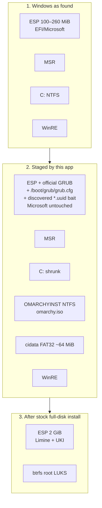

# Omarchy Install: Windows-to-Omarchy without USB

| Field | Value |
| --- | --- |
| **Author** | Jonathan / project maintainers |
| **Date** | 2026-08-31 |
| **Status** | Draft |
| **Product** | Omarchy Install (`omarchyinstall`) |
| **Identifier** | `dk.jonathanb.omarchyinstall` |
| **Version this doc describes** | 0.1.0 → v1 |

---

## Overview

Omarchy Install is a small Windows desktop app whose only job is to get a PC from “running Windows” to “booting the official Omarchy live installer,” **without a USB stick**. After reboot, the **stock Omarchy ISO installer** takes over: configurator, orchestrator, pacstrap from the bundled offline mirror, Limine, the same full-disk path a flashed USB would have used. That installer **replaces the entire Windows installation**. The machine that comes back is a native Omarchy install on real GPT partitions, booting Limine from an Omarchy ESP, identical to an install that started from USB.

This is **not Wubi**. Wubi (Ubuntu 8.04–12.04) installed Linux as a loopback file on NTFS, chained from Windows Boot Manager, and left Windows in place. This project uses Windows only as a **bootstrap host**. The Windows-side app mutates the disk just enough to boot the official Omarchy live environment from a **real partition**, then gets out of the way. Loopback of the ISO file as a *bootstrap* is acceptable; a loop-mounted *installed OS* is not. After the live orchestrator starts a `wipe: true` autoinstall, Windows is gone. There is no dual-boot, no leftover Wubi file, no NTFS root.

Closer analogies than Wubi: a Windows `setup.exe` that stages a real Linux installer on-disk and reboots into it; ChromeOS Flex / CloudReady’s “install from Windows” idea; Rufus or Ventoy automation. The end state is the opposite of those tools’ usual “keep Windows” posture: **Windows is the scaffolding, and scaffolding is demolished.**

The product ships as one portable `OmarchyInstaller.exe` (this Tauri 2 app). It does **not** bundle the ~6 GB Omarchy ISO. At runtime it shrinks Windows, creates an installer partition **and a tiny `cidata` volume**, downloads `https://iso.omarchy.org/omarchy-4.0.2.iso` (current as of 2026-08-31) plus `.sha256` / `.sig` sidecars **directly onto the installer partition**, verifies them, plants the official ISO GRUB on the existing ESP so its *embedded* search finds a config we wrote, writes autoinstall files so the Linux configurator is **skipped**, sets a one-shot UEFI `BootNext`, and reboots. The stock orchestrator then full-disk-wipes the Windows disk (`wipe: true`), including the staging partitions.

---

## User-facing product goal

A person on a Windows PC who wants Omarchy should be able to:

1. Download and run the portable **OmarchyInstaller.exe**. It does not register an installed application or uninstaller.
2. Run it elevated (Administrator). If it is not elevated, it offers **Relaunch as Administrator** (`ShellExecuteW` `runas`) and refuses to mutate the disk.
3. Walk a wizard that is explicit to the point of being rude: **this will erase Windows and all data on the selected disk and install Omarchy.**
4. Let the app check the machine (UEFI, GPT, disk map, BitLocker, Secure Boot, RAM, arch, elevation, shrinkable free space).
5. Answer the Omarchy identity questions in the Windows wizard (keyboard, username, password, hostname, timezone, encryption; optional git name/email). These become cidata for the official autoinstall path.
6. Confirm, more than once, with a disk map on screen. Linux will **not** ask again.
7. Let the app shrink Windows, create a **real installer boot partition** plus a tiny **`cidata` volume**, download the official Omarchy ISO onto the installer partition, and verify sha256 **and** the `.sig` against the pinned key `40DFB630FF42BCFFB047046CF0134EE680CAC571`.
8. Let the app register a one-shot UEFI boot entry and reboot.
9. Land in the **stock Omarchy live environment**. `omarchy-cidata-load` finds the `cidata` volume, skips the configurator, and the orchestrator full-disk-wipes the selected disk (`wipe: true`). That wipe **destroys Windows** and the staging partitions.
10. Next boot is Omarchy. No Windows. No USB. No loop-file OS.

The happy path does not require the user to flash a stick, find a USB port that will boot, or fight the firmware boot menu beyond turning **Secure Boot off** (required today; see below). All “Windows will be erased” confirms happen **in this app**, before reboot.

If anything fails *before reboot into the live environment*, the machine still boots Windows and Undo is available. Once the live orchestrator starts a `wipe: true` autoinstall, Windows is gone. The UI must say this in those words.

---

## Background & Motivation

### Current official journey

Omarchy is DHH’s opinionated Arch-based Linux (Hyprland). The **only supported install path today** is the official ISO (`references/omarchy-iso/README.md`, `references/omarchy/manual/02-getting-started.md`):

1. Download `https://iso.omarchy.org/omarchy-4.0.2.iso` (published as under 6 GB: three kernels + NVIDIA + T2. **Measure `Content-Length` at download time**; do not treat third-party size tables as a contract).
2. Verify `.sha256` and `.sig`.
3. Flash a USB with balenaEtcher / caligula.
4. Disable Secure Boot and/or TPM in firmware.
5. Boot the stick.
6. Answer the configurator; pick full-disk or free-space; watch the orchestrator.

That is a lot of ceremony for a destructive reinstall, and it is the ceremony this app removes. The ISO itself is not the problem. Finding, flashing, and booting removable media is.

### What the ISO already does well (and we will not redo)

The live environment is archiso (`configs/profiledef.sh`): `install_dir=arch`, squashfs airootfs with zstd, offline package mirror at `var/cache/omarchy/mirror/offline` stored **uncompressed** inside the squashfs. Boot modes: `bios.syslinux` and `uefi.grub`. Live UEFI path is **unsigned GRUB** as `BOOTX64.EFI`, produced by `grub-mkstandalone` with an **embedded** `grub-embed.cfg` (not a sibling `grub.cfg`). Kernel cmdline on the ISO volume today:

```
archisobasedir=%INSTALL_DIR% archisosearchuuid=%ARCHISO_UUID%
```

There is also `configs/grub/loopback.cfg` using `img_dev=UUID=... img_loop="${iso_path}"` for ISO-as-file boot. That file assumes `$root` is already the ISO; it does **not** `loopback` in GRUB, and it does **not** pass `copytoram`. Initramfs hooks include `archiso` and `archiso_loop_mnt` (`configs/airootfs/etc/mkinitcpio.conf.d/archiso.conf`). `references/omarchy-iso/archiso/` is an empty submodule in this checkout; hook semantics below are taken from upstream `mkinitcpio-archiso` master and **must be re-measured on 4.0.2** (PR 7a).

Live installer entry: `/usr/local/bin/omarchy-iso-install` → Python orchestrator at `configs/airootfs/usr/share/omarchy-iso/orchestrator/`. Configurator at `configs/airootfs/root/configurator`. Full-disk JSON sets `"wipe": true` on the selected disk (`user_configuration.json` `disk_config.device_modifications`). Installed bootloader is Limine with a UKI on the ESP.

ESP hygiene for *this app*: never write `EFI/Microsoft`. That is the same rule as `references/omarchy-iso/plans/consumer-secure-boot.md` (“Do not modify `EFI/Microsoft`”) and the configurator’s `detect_windows_esp` comments (Windows ESP is 100–260 MiB, too small for UKIs; Omarchy creates its own ESP and leaves Windows’ alone). `test/integration.d/factory-reset-test.sh` is ISO *culture* agreeing that installed Omarchy must not destroy a fixtured `EFI/Microsoft` on a shared ESP — a related product, not this app’s boot path.

The Windows app is a bootstrap. It does not reimplement partitioning, pacstrap, or Limine. It **does** collect the configurator’s answers and write cidata so autoinstall skips the Linux wizard.

### Pain this project exists to remove

- No spare USB, or a USB that the firmware will not boot.
- Flashing 6 GB over a slow port.
- The “did I pick the right stick / right boot entry” class of support load.
- The current user journey is documented as download → flash → firmware toggle → wizard. We keep the firmware toggle and the wizard. We delete the flash.

---

## Goals & Non-Goals

### Goals (v1)

- Take a UEFI GPT x86_64 Windows 10/11 PC to a **native Omarchy install** with no USB in the happy path.
- Use the **official Omarchy ISO** as the installer. This app prepares boot media in-place and hands off.
- Final disk layout is the stock full-disk Omarchy layout (2 GiB ESP + btrfs root, Limine, UKI), **Windows partitions gone**.
- Destructive UX: multiple confirms **in the Windows wizard**, on-screen disk map, the words “Windows will be erased.” Linux will not re-confirm (cidata autoinstall).
- Collect Omarchy identity in the Windows wizard and write a **`cidata` volume** so the stock ISO skips the configurator (`omarchy-cidata-load`). Generated config is **full-disk** with `"wipe": true` on the Windows disk, never free-space.
- Integrity: download from `iso.omarchy.org`, sha256 required, GPG `.sig` **required** against the pinned key.
- Reversible until reboot into a live environment that will autoinstall (`wipe: true` with no Linux confirm). Prefer `BootNext` so a failed firmware handoff still boots Windows; see UEFI handoff for the BootOrder footnote.
- Never write `EFI/Microsoft`.
- Detect BitLocker and **refuse** until every encryptable volume on the target disk is fully decrypted. Suspending is not enough. We block because **shrink and ESP writes on a BitLocker OS volume brick the machine with a recovery-key prompt**, not because the full-disk configurator will abort (it will not; see BitLocker).
- Detect Secure Boot and **block or instruct**. Do not invent a shim-signing program in this app.
- **Intel RST / VMD RAID: always block in v1** (`BlockingReason::Rst`). No attempt to install onto Intel RAID metadata.
- Detect TPM/fTPM and **mention** it; **do not refuse** solely because TPM is present. Only Secure Boot off is required to boot unsigned GRUB.
- Dev-on-Linux / production-on-Windows remains the engineering setup.

### Non-goals (v1)

- **Not Wubi.** No loop-mounted installed OS. No keeping Windows.
- **Not dual-boot.** The ISO’s free-space path exists (`manual/50-dual-boot-install.md`). This product is the full-disk replacement path. Cidata always emits `"mode": "full_disk"` and `"wipe": true`. We do not generate a free-space layout.
- **Not a reimplementation of the Omarchy installer.** No Windows-side pacstrap, no Windows-side Limine install of the final OS. The Windows wizard **does** collect the same answers the configurator would and writes them as cidata; the orchestrator still does the install.
- **Not a Secure Boot signing program.** Consumer Secure Boot is `references/omarchy-iso/plans/consumer-secure-boot.md` — future ISO work, not this app’s job.
- **Not bundling the 6 GB ISO in the portable EXE.** The Windows download stays small and the ISO stays current.
- **Not BIOS/CSM, not ARM Windows, not Dynamic Disks, not Storage Spaces, not Intel RST/VMD RAID, not multi-disk “install Omarchy on the other drive” in v1.** RST is a hard block, not a warning.
- **Not silently decrypting BitLocker, not clearing TPM, not modifying BitLocker protectors.** TPM presence is informational.
- **Not Authenticode-signing the portable EXE until first public release.** Dogfood unsigned internally. Signing is release-engineering, not a blocker for probe/wizard/lab.
- **Not 8 GiB RAM in v1.** v1 hard-gates 16 GiB installed / ~14 GiB `ullTotalPhys`, but this may exclude too much otherwise-supported hardware and must be revisited after v1. Candidate C (userspace copy-then-unmount) improves failure handling but, by itself, does **not** lower the RAM requirement because it still copies the same ~6 GiB squashfs into tmpfs. A genuinely lower-memory path needs Candidate D, a smaller/network-backed live environment, or an ISO whose live root and offline mirror are separated.
- **Not claiming “zero ISO bytes changed” until PR 7a measures it.** Initramfs `ntfs3` and `copytoram=y` releasing `img_dev` are lab gates. If either fails, we propose a patch against `references/omarchy-iso/` and do not ship mutate-capable Windows code against an ISO that cannot hand off.

---

## Wubi vs this project

| | **Wubi** (Ubuntu 8.04–12.04) | **Omarchy Install** |
| --- | --- | --- |
| Host | Windows | Windows, bootstrap only |
| What Windows writes | A loop file on NTFS (`ubuntu/disks/root.disk`) plus a Windows Boot Manager entry | A real GPT partition holding the official ISO as a file, plus a **one-shot** UEFI `BootNext` entry |
| What boots first after setup | Windows Boot Manager → GRUB → loop-mounted Ubuntu | Firmware `BootNext` → official ISO GRUB on the ESP → live environment via `img_loop` + `copytoram=y` |
| Where the OS lives | File on NTFS. Windows still owns the disk. | After the Linux installer: native GPT partitions. Windows is wiped. |
| Windows after success | Still there; uninstall from Add/Remove Programs | **Gone** |
| Loopback | The *installed OS* is a loop file | Loopback of the *ISO file* is allowed as bootstrap only |
| Dual-boot | Yes, by construction | No (v1). Full-disk replacement. |
| Uninstall / rollback | Uninstall Wubi, delete the loop file | Rollback only **before reboot into autoinstall**: delete `OMARCHYINST` + `cidata`, expand NTFS, remove ESP files we added, `BootNext` expires |
| End state | Windows + Ubuntu-in-a-file | Same as USB: Omarchy + Limine + UKI |
| Removable media | Not required | Not required in the happy path |
| Installer | Custom Wubi/`ubiquity` path | **Stock** Omarchy ISO configurator + orchestrator |

---

## What already exists in this repo vs what we still have to build

### Already here

This is a **Tauri 2** desktop app: React 19 + Vite frontend, Rust backend. Production is Windows only and ships as one portable `OmarchyInstaller.exe`, with an authenticated default-browser fallback when WebView2 is unavailable. `tauri dev` works on macOS/Linux so UI/IPC can be built there; Win32 is compiled only on Windows (`README.md`).

| Piece | Path | What it does today |
| --- | --- | --- |
| Product metadata | `src-tauri/tauri.conf.json` | `productName: Omarchy Install`, `identifier: dk.jonathanb.omarchyinstall`, portable build only, embedded assets/icons, and a manually created native window so WebView failure can fall back to the browser |
| Frontend | `src/App.tsx`, `src/types.ts`, `src/App.css` | Host-info panel only: OS, arch, osVersion, elevated, nativeWindows. **No wizard.** |
| IPC | `src-tauri/src/commands.rs` | Single command: `host_info` |
| App builder | `src-tauri/src/lib.rs` | Plugins `opener`, `log`; registers `commands::host_info` |
| Errors | `src-tauri/src/error.rs` | `Result<T>`, `WindowsOnly`, `Message`, `Io`, `Windows`; serialize as string for `invoke` |
| Win32 | `src-tauri/src/platform/windows.rs` | Elevation via `TOKEN_ELEVATION`; OS version from `HKLM\SOFTWARE\Microsoft\Windows NT\CurrentVersion` |
| Dev stub | `src-tauri/src/platform/stub.rs` | `elevated: false`, `native_windows: false`, `os_version: None` |
| Gate | `platform::require_windows()` | Non-Windows → `Error::WindowsOnly` |
| Tests | `platform/mod.rs`, `error.rs` | `host_info_matches_compile_target`; `windows_only_serializes_as_message`. `bun run check:rust` → `cargo test --manifest-path src-tauri/Cargo.toml` |
| Windows crate | `src-tauri/Cargo.toml` `[target.'cfg(windows)'.dependencies]` | Features: Foundation, Security, FileSystem, Com, Registry, SystemInformation, Threading |
| Capabilities | `src-tauri/capabilities/default.json` | `core:default`, `opener:default`, `log:default` on linux/macOS/windows |
| ISO / Omarchy checkouts | `references/omarchy-iso/`, `references/omarchy/` | Upstream sources this design is constrained by. Not shipped in the Windows bundle. `archiso/` submodule is empty. |

### Must be built

- Machine capability probe (Secure Boot, BitLocker, firmware, disks, RAM, shrink headroom, EFI variable access).
- `src-tauri/windows.manifest` with `requestedExecutionLevel` `requireAdministrator`, plus a UI **Relaunch as Administrator** path for development builds.
- Wizard UI (steps, copy, disk map, typed confirms) with **no disk mutation** until a late, gated step.
- ISO download onto `OMARCHYINST`, resume, sha256, **required** GPG. `reqwest` in Rust; **no** Tauri HTTP plugin.
- NTFS shrink + installer partition create (reversible).
- Stage official `BOOTX64.EFI` + search bait + `boot/grub/grub.cfg` on the ESP (reversible).
- SHA-512 crypt (`$6$`) in Rust; write `cidata` FAT volume (`user_configuration.json` + `user_credentials.json`).
- UEFI `BootNext` + reboot.
- Same-disk wipe strategy (`copytoram=y`) — **lab-gated before any shrink PR**.
- Abort/rollback path, including restore of Fast Startup / hibernation we turned off.
- Logging + support bundle.

---

## Proposed Design

### Architecture

```mermaid
flowchart LR
  subgraph win["Windows phase (this app)"]
    UI["React wizard\n`src/App.tsx`"]
    IPC["Tauri invoke\n`commands.rs`"]
    PL["`platform/windows.rs`\nWin32 / WMI / VDS"]
    UI --> IPC --> PL
  end

  subgraph disk["Internal GPT disk"]
    ESP["ESP\n`EFI/Microsoft` untouched\n`EFI/OmarchyInstall/BOOTX64.EFI`\n`boot/grub/grub.cfg`\n`boot/<iso-uuid>.uuid` (discovered)"]
    WIN["Windows NTFS\nshrunk"]
    INST["New `OMARCHYINST`\nNTFS sized to ISO\n`\\omarchy.iso`"]
    CI["New `cidata` ~64 MiB FAT32\nlabel cidata / CIDATA"]
    REST["Recovery / other\nleft alone until Linux wipe"]
  end

  PL --> ESP
  PL --> WIN
  PL --> INST
  PL --> CI

  subgraph fw["UEFI firmware"]
    BN["BootNext → OmarchyInstall\nBootOrder: Windows first"]
  end

  PL --> BN
  BN --> GRUB["Official ISO GRUB\nembed search → our grub.cfg"]
  GRUB --> LIVE["Official Omarchy live\nimg_loop + copytoram=y"]
  LIVE --> CILOAD["omarchy-cidata-load\nskips configurator"]
  CILOAD --> WIPE["Full-disk wipe: true\nWindows + staging gone"]
  WIPE --> OM["Native Omarchy\nLimine + UKI"]
```

Two processes, one disk, a firmware handoff:

1. **Omarchy Install (Windows)** — Tauri app. Mutates disk and NVRAM. Stops at reboot.
2. **Official Omarchy live installer (Linux)** — stock configurator + orchestrator, **if and only if** `copytoram=y` copied `airootfs.sfs` and released `img_dev`. Without that, full-disk wipe destroys the medium the live environment is still reading.

They share a **handoff contract**: on-disk layout, GPT labels, kernel cmdline, and “who is allowed to wipe what.” They do not share code.

### Phased end-to-end sequence

```mermaid
sequenceDiagram
  autonumber
  actor User
  participant App as Omarchy Install (Windows)
  participant Disk as Internal GPT disk
  participant NVRAM as UEFI NVRAM
  participant Live as Official Omarchy live ISO
  participant Orch as Orchestrator (stock)

  User->>App: Run portable EXE, elevated
  App->>App: probe_machine (UEFI, SB, BitLocker, RAM, disks)
  alt Secure Boot on / BitLocker not FullyDecrypted / RAM gate fail / not UEFI
    App-->>User: Block with instructions (no disk writes)
  end
  App-->>User: Wizard: identity + Windows will be erased
  User->>App: Username/password/disk confirms (typed ERASE WINDOWS)
  App->>App: HEAD ISO (Content-Length) to size OMARCHYINST
  App->>App: Re-probe BitLocker / shrink headroom / RST
  App->>Disk: Disable hibernation / Fast Startup as needed
  App->>Disk: Shrink C:, create OMARCHYINST (NTFS) + cidata (FAT32 ~64 MiB)
  App->>Disk: Download ISO + sidecars onto OMARCHYINST, verify sha256+.sig
  App->>Disk: Extract BOOTX64.EFI, plant discovered *.uuid bait + /boot/grub/grub.cfg on ESP
  App->>Disk: Write user_configuration.json + user_credentials.json onto cidata
  Note over Disk: EFI/Microsoft is not touched; cidata has no drive letter
  App->>NVRAM: Create Boot####, set BootNext
  App->>User: Reboot now — Linux will not ask again
  App->>NVRAM: ExitWindows / shutdown
  NVRAM->>Live: BootNext → official GRUB → our grub.cfg → img_loop + copytoram=y
  Note over Live: airootfs.sfs copied to tmpfs; bootmnt gone; img_dev unmounted
  Live->>Live: omarchy-cidata-load (label cidata) skips configurator
  Live->>Orch: omarchy-iso-install → prepare_live
  Orch->>Disk: omarchy-iso-cleanup-disk, wipe: true
  Note over Disk: Windows, OMARCHYINST, old ESP all destroyed
  Orch->>Disk: 2 GiB ESP + btrfs, pacstrap from offline mirror, Limine UKI
  Orch->>NVRAM: Register Limine EFI entry
  Orch->>User: Reboot into Omarchy
```

#### Phase A — Windows (this app), reversible

1. Launch. If `elevated == false`: offer **Relaunch as Administrator** (`ShellExecuteW` verb `runas` on our exe). Packed builds should already be `requireAdministrator` via `src-tauri/windows.manifest`. Stub hosts (`platform/stub.rs`) never mutate; they only render UI. Download/verify **are** allowed on stub hosts (see API).
2. `probe_machine`: UEFI, GPT, Secure Boot, BitLocker on **every** `Win32_EncryptableVolume` on the boot disk, RAM **installed** + `ullTotalPhys` (hard gate) and `ullAvailPhys` (warning only), CPU arch, disk map (ESP, MSR, C:, Recovery, free regions, per-partition type GUID / letter / label / GPT GUID), shrinkable bytes, and EFI variable write access proven by creating, reading, and deleting an app-owned probe variable. The target ESP must be the unique ESP on the same disk as `C:`. Structured `blocking_reasons`.
3. Wizard: identity (keyboard, username, password, hostname, timezone, encryption default-on; optional git name/email). Disk map. Typed confirmation (`ERASE WINDOWS`) **twice**. Linux will not ask. No writes yet.
4. `HEAD` the pinned ISO URL for `Content-Length`. `OMARCHYINST` size = `max(8 GiB, content_length * 1.2 + 512 MiB)`. Add **64 MiB** for the `cidata` FAT32 partition (plus alignment).
5. **Re-probe BitLocker, RST, and shrink headroom immediately before mutate.**
6. Prepare Windows volume: Fast Startup off, `powercfg /h off` (drops `hiberfil.sys`). **v1 does not disable the pagefile or demand a reboot-and-resume.** If QueryMax is still short of the combined size, fail with the unmovable-files message and stop.
7. Shrink C:. Create two GPT partitions in the hole, **no persistent drive letters**:
   - `OMARCHYINST` — NTFS, formula size, ISO payload.
   - `cidata` — FAT32, ~64 MiB, volume label `cidata` (Windows may store `CIDATA`; `omarchy-cidata-load` accepts both).
   Persist `state.json` **before** the shrink and again with both partition GUIDs.
8. Download the ISO (resume via `Range`) to `\\?\Volume{OMARCHYINST-GUID}\omarchy.iso`, plus `.sha256` and `.sig` beside it. Verify in Rust against the sidecar and the pinned GPG key.
9. Stage the journaled ESP on the Windows boot disk (Bootloader staging). Never select the first ESP system-wide. Do not overwrite `EFI/Microsoft` or `EFI/Boot/bootx64.efi`.
10. Hash the password with SHA-512 crypt (`$6$`, `openssl passwd -6` compatible) in Rust. Write cidata files onto the FAT volume (see Cidata autoinstall). **Do not persist the plaintext password in `state.json` after hashing.** Set the FAT partition hidden and no-default-drive-letter. FAT32 has no Windows ACL support, so this reduces accidental exposure but is not an access-control boundary against an administrator.
11. Create a firmware boot entry pointing at `\EFI\OmarchyInstall\BOOTX64.EFI`. Set **`BootNext`**. Record `Boot####` in the journal. Do not prepend ourselves on `BootOrder`; see UEFI handoff if firmware ignores `BootNext`.
12. Reboot.

#### Phase B — Reboot into the official live environment

Firmware honors `BootNext` once. Official `BOOTX64.EFI` (grub-mkstandalone) runs its **embedded** search for the baked `ARCHISO_SEARCH_FILENAME` (current mkarchiso: `/boot/<iso-uuid>.uuid`, **not** `/.disk/`), finds it on the ESP (we planted the exact relative path we discovered from the ISO), and `configfile`s `(ESP)/boot/grub/grub.cfg` — **our** file. That file locates `\omarchy.iso` on `OMARCHYINST`, GRUB-loopbacks it **only to load kernel/initrd**, and passes `img_dev=PARTUUID=<OMARCHYINST GPT GUID> img_loop=/omarchy.iso copytoram=y copytoram_size=<N>G`.

archiso then, if `copytoram=y` actually runs:

1. Mounts `img_dev` (must succeed on **NTFS** in the **initramfs**).
2. Loop-mounts the ISO, finds `arch/x86_64/airootfs.sfs`.
3. Copies **only that squashfs** into `/run/archiso/copytoram` (tmpfs).
4. `umount -d /run/archiso/bootmnt` and `rmdir` it.
5. `archiso_loop_mnt` `losetup -d` and `umount /run/archiso/img_dev`.

After success, `findmnt /run/archiso/bootmnt` **fails** (bootmnt is gone, not “a tmpfs”). `OMARCHYINST` is unmounted. Wipe is then safe.

**Without `copytoram=y` (or if auto silently declines), wipe is unsafe.** The configurator will still *offer* the internal disk: bootmnt is a **loop device**, and `get_root_disk` cannot walk `PKNAME` to the Windows disk, so `disk_form` does not hide it. USB-from-partition without copytoram is not “disk hidden”; it is “disk offered, then `prepare_live` → `omarchy-iso-cleanup-disk` → `wipe: true` saws off the medium.”

If `BootNext` is ignored or GRUB fails, Windows is still first on `BootOrder`. The user is back in Windows. The app offers rollback.

#### Phase C — Omarchy autoinstall (stock orchestrator, skipped configurator)

`.automated_script.sh` on tty1 runs `omarchy-cidata-load`. With a volume labeled `cidata` or `CIDATA` carrying `user_configuration.json` **and** `user_credentials.json`, the script copies them to `/root` and **skips** `./configurator`. The dashboard then wraps `omarchy-iso-install` as usual.

There is **no** Linux overwrite prompt. The last human gate is the Windows wizard. `copytoram=y` must already have released `OMARCHYINST` / `img_dev` before `wipe: true` runs, or the live environment is destroyed mid-install.

`defer-provisioning` is **not** the v1 default (we collect credentials). It remains a later option (empty credentials + marker file).

#### Phase D — Full-disk wipe and first Omarchy boot

`prepare_live` calls `omarchy-iso-cleanup-disk` on the wipe target, then archinstall applies `device_modifications` with `"wipe": true` for the **entire** Windows disk (ESP, MSR, C:, Recovery, `OMARCHYINST`, `cidata`). Offline mirror is bind-mounted from `/var/cache/omarchy/mirror/offline` onto the target cache (`_mount_offline_package_cache`). Limine + UKI are installed on a **new** 2 GiB ESP. Next boot is Omarchy.

Staging partitions are gone. That is success.

---

## On-disk layout

### Before (typical Windows laptop)

```
[ GPT ]
  p1  ESP          100–260 MiB  FAT32   EFI/Microsoft/Boot/bootmgfw.efi
  p2  MSR          ~16 MiB      unformatted
  p3  Windows      rest         NTFS    C:
  p4  Recovery     500–1500 MiB NTFS    WinRE   (often at the tail)
```

The ESP is **too small** to hold a 6 GB ISO. We will not put the live environment on it. We will not enlarge it from Windows in v1 (moving/resizing ESP is a firmware-brick class of bug).

WinRE at the tail is the usual reason “shrink C:” does not produce trailing unallocated space at the end of the disk. That is fine: we create `OMARCHYINST` in the **hole between C: and Recovery**. GPT does not require the installer partition to be last.

### After Windows bootstrap (still reversible)

```
[ GPT ]
  p1  ESP          100–260 MiB  FAT32
       EFI/Microsoft/...                 (untouched)
       EFI/Boot/bootx64.efi              (untouched)
       EFI/OmarchyInstall/BOOTX64.EFI    (official ISO GRUB, grub-mkstandalone)
       boot/grub/grub.cfg                (OURS — path the embed cfg loads)
       boot/<iso-uuid>.uuid              (search bait: exact relative path discovered from the ISO;
                                         typically /boot/<iso_uuid>.uuid on current mkarchiso)
  p2  MSR          ~16 MiB
  p3  Windows      original minus (OMARCHYINST + cidata)   NTFS
  p5  OMARCHYINST  max(8 GiB, iso*1.2+512 MiB)             NTFS   \omarchy.iso
  p6  cidata       ~64 MiB                                  FAT32  label cidata
  p4  Recovery     unchanged
```

Partition numbers are illustrative. `disk-partitioning.sh` is explicit: **never predict a partition number**; parted fills the lowest free GPT slot. The Windows side records the **GPT GUID** of the partition it created, not “it will be p5.”

`EFI/OmarchyInstall/grub.cfg` is **not** a file we write. The official binary will never read it.

### After Omarchy full-disk install (Windows gone)

```
[ GPT ]
  p1  ESP     2 GiB    FAT32   EFI/limine + UKI   (new; old ESP wiped)
  p2  root    rest     btrfs   @, @home, @log, @pkg, LUKS by default
```

This is the stock full-disk layout from the configurator (`boot_partition_size = 2 GiB`, `wipe: true`). Limine is the bootloader. No `OMARCHYINST`. No Microsoft directory unless the user somehow dual-booted, which v1 does not.



---

## What “boot partition for the installer” means

### Recommendation

| Item | Choice |
| --- | --- |
| New partition | Yes. Label `OMARCHYINST`, size formula below. |
| Filesystem | **NTFS**, not FAT32. Hard ISO dependency: initramfs must mount it (`ntfs3`). |
| Payload | **Official ISO as a single file** (`\omarchy.iso`), downloaded onto this volume. |
| Boot | Official ISO `BOOTX64.EFI` on the **existing ESP** at `EFI/OmarchyInstall/`, plus search bait and **our** `boot/grub/grub.cfg`. |
| Kernel cmdline | `archisobasedir=arch img_dev=PARTUUID=<OMARCHYINST GUID> img_loop=/omarchy.iso copytoram=y copytoram_size=<N>G` plus the ISO’s `xe.enable_panel_replay=0 initramfs_async=0`. **No** `quiet` (copy progress). |

### Why NTFS, not FAT32

The ISO is ~6 GB as published. FAT32’s file size limit is 4 GiB − 1. The squashfs (`arch/x86_64/airootfs.sfs`) is almost the whole ISO because the offline mirror is stored uncompressed in it (`profiledef.sh` `-action uncompressed@subpathname(var/cache/omarchy/mirror/offline)`). Extracting the ISO onto FAT32 does not help: the squashfs itself exceeds 4 GiB.

So the installer partition cannot be FAT32, whether we store a file or an extracted tree.

NTFS is the least-wrong Windows-native choice **if** two independent layers can read it:

1. **GRUB** — official module list already includes `ntfs ntfscomp iso9660 loopback` (`configs/grub/grub.cfg`). Needed to GRUB-loopback the ISO so we can load kernel/initrd.
2. **Linux initramfs** — `archiso_loop_mnt` does `_mnt_dev "${img_dev}" "/run/archiso/img_dev"`. That is `ntfs3` (or `ntfs`) in `initramfs-linux-t2.img`, plus udev `PARTUUID=` rules. Omarchy’s `archiso.conf` has **no** `MODULES=` line and **no** `autodetect`; a full `/kernel/fs` add is *possible* but **not proven** (`archiso/` submodule empty). **PR 7a must `lsinitcpio` / emergency-shell test an NTFS `img_dev`.** If `ntfs3` is missing, this is a **hard ISO-side add**, not a Windows GRUB tweak, and Candidate C is the wrong fallback.

exFAT is a backup format if NTFS-from-GRUB or NTFS-from-initramfs fails — and it has the **same** initramfs-module question (`exfat`). Do not advertise it as a free lunch.

ext4 would be nicer for Linux and worse for Windows (we would have to ship an ext4 writer). v1 is NTFS, gated on the lab.

The ESP stays FAT32. It only holds a few megabytes of GRUB plus two small bait files.

### Why ISO-as-file + img_loop, not an extracted tree

`configs/grub/loopback.cfg` already implements the **kernel** half of ISO-as-file boot (`img_dev` / `img_loop`). We do not source that file verbatim: it uses `UUID=` (wrong identifier for NTFS), has no `copytoram=y`, and assumes `$root` is already the ISO.

Using img_loop means:

- The bytes on disk are the same bytes we hashed.
- Staging is a file download, not an extract of 6 GB of tree.
- We do not invent an `archisosearchuuid` story for a partition that is not the ISO volume.

**Loopback here is bootstrap only.** The installed OS is never a loop file. If that sentence is not true of a design patch, the patch is wrong.

### Why a new partition, not “drop files on the ESP”

Windows ESPs are typically 100–260 MiB. Omarchy’s own free-space path creates a **2 GiB dedicated ESP** and refuses to adopt the Windows one (`detect_windows_esp` comments). We follow that instinct even earlier: the live ISO cannot live on the Windows ESP.

ESP **is** the right place for a small EFI binary that chainloads the installer partition — and for the two bait files official GRUB looks for.

### Partition size

Do not hard-code 8 GiB as the only size. After `HEAD` (and again after verify):

```
partition_bytes = max(8 GiB, iso_size * 1.2 + 512 MiB)
```

Refuse to format `OMARCHYINST` as FAT32. Fail if the verified ISO + 15% does not fit.

---

## Same-disk install (the hard problem)

The live environment is stored on the disk the stock installer is about to wipe. `prepare_live` → `omarchy-iso-cleanup-disk $disk` unmounts holders, then archinstall wipes. If `/run/archiso/img_dev` (the NTFS `OMARCHYINST`) or the loop backing `img_loop` still lives on that disk, the install saws off the branch it is sitting on. USB-from-disk does **not** “just work.”

### What `copytoram` actually does

Verified against upstream `mkinitcpio-archiso` master hooks (`hooks/archiso`, `hooks/archiso_loop_mnt`). **Not** in this repo (`references/omarchy-iso/archiso` is empty). Re-measure on 4.0.2.

| Fact | Detail |
| --- | --- |
| Default | `copytoram=auto`, **not** on. Bare `copytoram` without `=y` is sloppy and must not be what we emit. |
| Auto rule | Enable only if squashfs **< 4 GiB** and `MemAvailable > squashfs + 2 GiB`, and the image is not on `/dev/sr*`. Omarchy’s uncompressed-in-squashfs mirror makes `airootfs.sfs` ~6 GiB, so **auto never fires**. `copytoram=auto` on a 16 GiB machine will silently **not** copy. |
| `copytoram=y` copies | **Only** `airootfs.sfs` (or `.erofs`) into `/run/archiso/copytoram`. **Not** the ISO9660 tree, **not** the 6 GB ISO file as a whole. Size is still ~6 GiB because the squashfs *is* the ISO’s bulk. |
| tmpfs | `copytoram_size` default `75%`. We set an **absolute** size: `max(8G, ceil(iso_size_GiB)+2)` so a 16 GiB box keeps RAM for the live OS (75% of 16 GiB = 12 GiB tmpfs would squeeze the rest). |
| After copy | `umount -d /run/archiso/bootmnt` then `rmdir`. `archiso_loop_mnt` then `losetup -d` and `umount /run/archiso/img_dev`. |
| Lab invariant | `findmnt /run/archiso/bootmnt` **fails** and `OMARCHYINST` is **not** mounted. Not “bootmnt is tmpfs.” |

**Without `copytoram=y` (or Candidate C), the configurator will still offer the internal disk and full-disk wipe is unsafe.** Disk-hiding is the wrong invariant.

### Candidate A — `copytoram=y` of `airootfs.sfs` — **v1 default**

**RAM budget (order of magnitude, squashfs ≈ ISO ≈ 6 GiB):**

| Consumer | Size | Notes |
| --- | --- | --- |
| copytoram tmpfs | `copytoram_size` (8 GiB for 4.0.2) | Holds the squashfs file (~6 GiB) |
| Live overlay / cow | 0.3–1.0 GiB | archiso cow defaults; Plymouth + configurator + Python |
| Kernel + userspace RSS | 0.5–1.0 GiB | |
| pacstrap working set | 1–3 GiB reclaimable | bind-mount of the mirror, now from RAM |
| **Peak, conservative** | **~8–11 GiB** | |

- **Hard block: ≥ 16 GiB installed** (`GetPhysicallyInstalledSystemMemory`). Optionally also **`ullTotalPhys` ≥ ~14 GiB** so a 16 GiB SKU with a large iGPU/firmware carve-out still has enough physical RAM for an 8 GiB tmpfs after Windows is gone. Carve-out shows up as `ullTotalPhys` **below** installed size, not as low `ullAvailPhys`.
- **`ullAvailPhys` is a warning only.** `copytoram=y` runs in the initramfs **after Windows is gone**. A 16 GiB laptop with Chrome/Defender using 8 GiB at probe time is still a 16 GiB machine. UI may say “close apps if you like; it does not affect the Linux copy.” Do not `BlockingReason::Ram` on available bytes.
- **8 GiB installed:** 6 GiB squashfs copy will OOM. **Block.**
- Copy time: ~6 GiB from NVMe is 15–40 s; from HDD, minutes. Omit `quiet` so `pv` can show progress; Plymouth `splash` may still hide it — lab-check.

**Not the remaining risk: HOOKS order.** Official releng HOOKS are `archiso` then `archiso_loop_mnt`. `run_hook` for `archiso` sets `mount_handler=archiso_mount_handler`; `archiso_loop_mnt` **overrides** it when `img_dev`+`img_loop` are set. `mount_handler` runs after *all* `run_hook`s, so `block`/`filesystems` have already loaded modules. This is how `loopback.cfg` / Ventoy-style ISO files boot. Over-weighting HOOKS order will send an ISO patch at the wrong file.

**Remaining risks:** (1) `ntfs3` in initramfs, (2) `copytoram=y` actually releasing `img_dev` for a 6 GiB squashfs, (3) OOM.

### Candidate B — copytoram of airootfs only; keep the offline mirror on `OMARCHYINST` until pacstrap finishes

The mirror lives *inside* the squashfs. Copying “airootfs only” copies the mirror anyway unless the ISO is rebuilt to relocate it. Not v1.

### Candidate C — userspace copy-then-unmount in `prepare_live`

Same RAM cost as A, moved from initramfs to userspace. Advantage: gum error instead of an emergency shell. **Valid fallback if initramfs copy leaves `img_dev` busy. It is not an 8 GiB solution:** copying later does not make the ~6 GiB squashfs smaller, and an OOM remains an OOM. **Wrong fallback if NTFS cannot be mounted in initramfs** — we never reach userspace.

Sketch (against `references/omarchy-iso/`, not implemented here):

- Kernel cmdline flag `omarchy_from_disk=1`.
- `prepare_live`: if flag set and `img_dev` still mounted, copy squashfs/mirror to tmpfs, unmount, `losetup -d`, then `omarchy-iso-cleanup-disk`.

### Candidate D — “Install around the media, then eat it”

Do not use full-disk `wipe: true`. Delete Windows partitions while preserving `OMARCHYINST`, create the Omarchy ESP and root in the reclaimed space, and install from the still-mounted staging partition. Because the running live system itself depends on the ISO, it cannot safely delete `OMARCHYINST` before leaving that environment. The safer design is to boot the installed system, remove `OMARCHYINST` and `cidata` from a guarded first-boot service, then extend the adjacent root partition, LUKS mapping, and btrfs filesystem. Expected RAM is on the order of ~2 GiB rather than a ~6 GiB squashfs copy.

This is a credible lower-memory/offline design, but it trades the RAM requirement for substantially more installer complexity:

- It replaces the stock, well-tested full-disk `wipe: true` layout with partition planning and cleanup that this project must own and keep compatible with upstream.
- `OMARCHYINST` must be placed adjacent to the future root partition so its space can be reclaimed. OEM recovery partitions and unusual Windows layouts expand the test matrix.
- Installation becomes two-stage. A power loss or cleanup failure can leave the staging partitions behind; recovery must be idempotent and the installed system should remain bootable.
- Encrypted installs must grow the GPT partition, LUKS mapping, and btrfs filesystem in the correct order.
- `cidata` and its sensitive installation material survive until first-boot cleanup instead of disappearing in the initial wipe.
- The ISO, loop devices, offline-mirror bind mounts, and live root must remain intact through pacstrap. Cleanup cannot begin merely because package installation finished.

The payoff is support for 8 GiB, and potentially 4 GiB, systems without requiring network access after Windows is erased. A stranded staging partition is generally recoverable, but this path requires dedicated lab coverage across representative OEM disk layouts. **Not v1.**

### Future follow-up — lower-memory installs

v1 keeps the 16 GiB installed / ~14 GiB `ullTotalPhys` hard gate because `copytoram=y` is the smallest change that preserves the stock full-disk installer. Treat that number as a conservative implementation constraint, **not** a permanent product requirement. Before broad release, measure the real peak and consider deriving the gate from the verified `airootfs.sfs` size plus measured headroom instead of a fixed SKU threshold.

For actual 8 GiB support, investigate Candidate D as the offline path and a small network-backed live environment as the simpler online path. The online design can wipe normally and download packages afterward, but it makes working networking after the destructive step mandatory. Separating the live root from the offline package mirror in the official ISO may provide a middle ground. Do not describe Candidate C alone as removing the 6 GiB tmpfs cost.

### v1 decision

Ship candidate A: **`copytoram=y`**, 16 GiB **installed** RAM gate (`ullAvailPhys` warning only), NTFS `img_dev` by PARTUUID. **PR 7a lab report is a merge gate before any shrink/ESP/BootNext PR.** If 4.0.2 cannot mount NTFS in initramfs, that is an ISO patch (`MODULES=(ntfs3)` or equivalent) **before** this app’s mutate path. If copytoram leaves `img_dev` busy, Candidate C. Do not ship Decision D as a hope.

---

## Creating space from Windows

Needed contiguous payload: `OMARCHYINST` formula size above (floor 8 GiB) **plus ~64 MiB** for the `cidata` FAT32 partition (plus alignment).

NTFS shrink is blocked by unmovable files: `hiberfil.sys`, `pagefile.sys`, `System Volume Information` (USN journal, shadow copies), Fast Startup (`HiberbootEnabled`). Practical **v1** sequence:

1. Require elevation (manifest + detect + `runas` relaunch).
2. Turn off Fast Startup (`HKLM\SYSTEM\CurrentControlSet\Control\Session Manager\Power\HiberbootEnabled = 0`). Record the previous value in `state.json`.
3. `powercfg /h off` — deletes `hiberfil.sys`. Record that we did this.
4. Query shrinkable bytes. If still short of `partition_bytes`, **fail closed** with: “Windows will not give back N GB; free space is fragmented by unmovable files.” **v1 does not disable the pagefile, does not defrag, and does not reboot-and-resume the wizard.** Those are a future PR if the fail rate is high.
5. Shrink via **Storage WMI** (`MSFT_Volume.Resize` / `MSFT_Partition.Resize`) or VDS; `FSCTL_SHRINK_VOLUME` is the underlying ioctl; `diskpart` is last-resort diagnostics, not the primary API.
6. Create partition in the new unallocated region. Format NTFS, label `OMARCHYINST`, GPT attribute “no drive letter.”
7. Download the ISO using the volume GUID path (`\\?\Volume{...}\omarchy.iso`).

**Intel RST / VMD, Dynamic Disks, Storage Spaces:** detect and **block**.

**BitLocker** must already be fully decrypted before shrink. Re-probe immediately before this step.

On abort (PR 8): delete `OMARCHYINST` **and `cidata`**, extend C:, restore Fast Startup and hibernation to the journaled previous values. Leaving hibernation off on a Windows install the user kept is a behavior change; rollback must undo it. The cidata delete is **security-relevant** (possible plaintext LUKS passphrase).

---

## UEFI handoff

Goal: one attempt at the installer; if it never starts, Windows still boots.

| Mechanism | Use |
| --- | --- |
| `BootNext` | **Yes, primary product intent.** One-shot. Firmware consumes it. |
| `BootOrder` from Windows | **Do not prepend.** Windows stays first. **Footnote:** some OEM firmware ignores `BootNext` unless the entry is **also in `BootOrder`**. Escape hatch: **append** (not prepend) our `Boot####` so the firmware boot menu and those OEMs see it, without stealing the default. Probe cannot detect this without a reboot; the rollback UX already covers “you landed in Windows again.” |
| `EFI/Boot/bootx64.efi` (fallback) | **Do not overwrite.** Windows often owns it. |
| `EFI/Microsoft` | **Do not touch.** Cite `plans/consumer-secure-boot.md` and `detect_windows_esp`. |
| `EFI/OmarchyInstall/BOOTX64.EFI` | **Yes.** Official ISO GRUB. |

`Boot####` is an **`EFI_LOAD_OPTION` blob**, not a path string: `UINT32` attributes, `UINT16` filePathListLength, UTF-16 description, device path list `HD(partition,gpt,<PARTUUID of the ESP>)/File(\EFI\OmarchyInstall\BOOTX64.EFI)`, optional extra data. Allocating a free `Boot####` (0000–FFFF, skip existing) and persisting it in `state.json` is required.

**v1 implementation (primary):** `bcdedit /enum firmware` and `bcdedit /set {fwbootmgr} bootsequence {id}` — the documented Windows equivalent of BootNext — plus creating a firmware application entry that points at `\EFI\OmarchyInstall\BOOTX64.EFI`. Packing `EFI_LOAD_OPTION` ourselves via `SetFirmwareEnvironmentVariableEx` is the right API family and a **follow-up** if bcdedit is insufficient; do not treat the raw blob as a footnote and then leave implementers to invent it.

Privilege `SE_SYSTEM_ENVIRONMENT_NAME` must be enabled on the token (Administrator is necessary, not sufficient). Probe EFI variable writes **before** shrink. Some vendors lock NVRAM; some Hyper-V SKUs do not expose it. Fail closed.

USB fallback is an explicit later path if firmware ignores BootNext even with the append hatch — not v1 happy path.

---

## Bootloader staging (official GRUB, our config)

### Why `EFI/OmarchyInstall/grub.cfg` is dead code

Upstream `mkarchiso` `_make_bootmode_uefi.grub` builds a `grub-mkstandalone` whose **embedded** `grub-embed.cfg` (memdisk path `boot/grub/grub.cfg` inside the EFI binary, **not** `${cmdpath}/grub.cfg`) does:

1. `search --file '%ARCHISO_SEARCH_FILENAME%'` — a path baked in at ISO build time.
2. `configfile "(${ARCHISO_HINT})/boot/grub/grub.cfg"` on **that volume**.

Current mkarchiso (`_make_iso_limited_grubenv_and_search_uuid_file`) sets `search_filename="/boot/${iso_uuid}.uuid"` with an explicit comment that they **stopped using `/.disk/`** so a leading-dot directory is not missed when copying ISO contents. Do not “fix” this back to `.disk`. Older docs and grub-mkrescue still mention `/.disk/`; the **binary we copy from the verified ISO** is the source of truth.

Copying `EFI/BOOT/BOOTX64.EFI` onto the Windows ESP and writing a sibling `EFI/OmarchyInstall/grub.cfg` therefore searches for the ISO9660 identity file, fails (the ISO is a file on NTFS, not a volume), and never reads our config. NTFS/loopback modules *are* in the official binary; it can do the job **if it is actually instructed to**.

The security rule is: **the EFI binary on the ESP is the one inside the verified ISO.** We do not ship a second bootloader from this repo. We *do* write a GRUB **config** at the path that binary already loads.

### Chosen approach (option 1)

After the ISO is hashed on `OMARCHYINST`:

1. Extract `EFI/BOOT/BOOTX64.EFI` from the ISO (Joliet / Rock Ridge name; see extraction) → ESP `\EFI\OmarchyInstall\BOOTX64.EFI`.
2. Discover `ARCHISO_SEARCH_FILENAME` from the ISO and plant **that exact relative path** on the ESP. GRUB’s `--hint` is `cmdpath` (the ESP, because that is where the EFI binary lives), so search hits the ESP, not some other volume. Typical current path: `/boot/<iso_uuid>.uuid`. **Do not hardcode `.disk` vs `boot`.**
3. Write **our** loopback/img_loop menu at **`ESP:\boot\grub\grub.cfg`** — the path the embed cfg loads. Not `EFI/OmarchyInstall/grub.cfg`.
4. Lab check: “embedded GRUB actually executes *our* menuentry” (serial console or a visible timeout during development builds).

Option 2 (Linux CI `grub-mkstandalone` with `configfile ${cmdpath}/grub.cfg`) is the honest custom-GRUB fallback if option 1 fails in the lab. It would drop “no second bootloader.” We do not claim option 1 while describing option 2’s layout.

### Windows extraction of ISO9660 names

archiso uses xorriso with Joliet + rational Rock Ridge. Windows 10+ `Mount-DiskImage` and a Rust ISO9660/Joliet reader both see those names. ISO9660 Level 1 alone would mangle long names; **prefer Joliet/RR, do not parse only the 8.3 tree.**

| ISO path (Joliet / Rock Ridge) | Destination |
| --- | --- |
| `/EFI/BOOT/BOOTX64.EFI` | ESP `\EFI\OmarchyInstall\BOOTX64.EFI` |
| unique `*.uuid` (typically `/boot/<iso_uuid>.uuid` on current mkarchiso) | **Same relative path on the ESP.** Glob the unique `*.uuid` under Joliet/RR (do **not** constrain the glob to `.disk`). That relative path **is** the baked search filename. |
| `/boot/grub/grub.cfg` | **Do not copy from the ISO.** That is the ISO-volume menu (`archisosearchuuid`). We write our own at the same path **on the ESP**. |
| `/arch/boot/x86_64/vmlinuz-linux-t2` and `initramfs-linux-t2.img` | Not copied. GRUB loopbacks the ISO file to load them. |

Discovery order:

1. Unique `*.uuid` file in the ISO Joliet/RR tree (fail if zero or more than one).
2. Fallback: parse `ARCHISO_SEARCH_FILENAME=` from ISO `/boot/grub/grubenv` if present.
3. Fallback: scan the verified `BOOTX64.EFI` for a `*.uuid` path string (not a hardcoded `/.disk/` prefix).

Rollback deletes `EFI\OmarchyInstall\`, `boot\grub\grub.cfg`, and **the discovered search-bait path** (e.g. `\boot\<iso_uuid>.uuid`). Do not delete `.disk\` unless that was the path we actually planted. If `/boot/` then only contains our bait + `grub\`, remove those files; do not wipe an unrelated `\boot` we did not create.

### Exact `boot/grub/grub.cfg` we emit

Official `loopback.cfg` does **not** `loopback` in GRUB; it assumes `$root` is already the ISO. After the embed cfg runs, `$root` is the **ESP**, so we **must** GRUB-loopback the ISO before `linux /arch/boot/...` or the kernel would be loaded from the ESP (where it is not). `install_dir=arch`. We bake the GPT GUID from `state.json`; we do not `probe --fs-uuid` (NTFS volume serial vs Linux `UUID=` is a known mismatch class).

```grub
insmod part_gpt
insmod ntfs
insmod ntfscomp
insmod iso9660
insmod loopback

search --no-floppy --set=img_part --file /omarchy.iso
set iso_path="/omarchy.iso"
export iso_path
loopback loop (${img_part})${iso_path}
set root=(loop)

set default=0
set timeout=0

menuentry "Omarchy Installer" --id 'archlinux' {
    set gfxpayload=keep
    linux /arch/boot/x86_64/vmlinuz-linux-t2 \
        archisobasedir=arch \
        img_dev=PARTUUID=________-____-____-____-____________ \
        img_loop="${iso_path}" \
        copytoram=y \
        copytoram_size=8G \
        splash xe.enable_panel_replay=0 initramfs_async=0
    initrd /arch/boot/x86_64/initramfs-linux-t2.img
}
```

The app substitutes the real `OMARCHYINST` GPT GUID and a `copytoram_size` of `max(8G, ceil(iso_GiB)+2)`. **No `quiet`** — archiso uses `pv` when `copytoram=y`; hiding that 6 GiB copy behind `quiet splash` leaves only the Windows-side “wait” note. Keep `splash` for now; lab should record whether Plymouth hides `pv` and whether dropping `splash` is needed.

`img_dev=PARTUUID=` is accepted by mkinitcpio `resolve_device` / archiso `_mnt_dev` (`UUID=` / `LABEL=` / `PARTUUID=` / `PARTLABEL=`). fs-uuid stays a diagnostic in `state.json`, not the cmdline.

---

## Cidata autoinstall (Decision H)

`omarchy-cidata-load` looks up **`/dev/disk/by-label/cidata` or `CIDATA`**, mounts it read-only, and copies files into `/root`. It does **not** look at `OMARCHYINST`. A second volume labeled `cidata` is the **no-ISO-patch** solution. Required pair: `user_configuration.json` **and** `user_credentials.json` (a `defer-provisioning` marker may stand in for credentials; **v1 does not use that**). Anything less and the script exits 1 and the configurator runs — which we do not want after the user already confirmed wipe.

### Volume

| Item | Choice |
| --- | --- |
| Partition | New GPT partition in the shrink hole, **next to** `OMARCHYINST`, ~**64 MiB** |
| Filesystem | **FAT32** (files are kilobytes; the 4 GiB cap is irrelevant) |
| Label | `cidata` (Windows Format may write `CIDATA`; the loader accepts both) |
| Drive letter | None. Access via `\\?\Volume{GUID}\` |
| Windows exposure | Hidden + no-default-drive-letter. FAT32 cannot enforce an Administrators+SYSTEM DACL; treat it as a **secret** and delete it on abort. |
| GPT name | `cidata` |

Do not put cidata files on `OMARCHYINST` (NTFS, wrong label). Do not require an ISO patch to `omarchy-cidata-load`.

### Files (from `references/omarchy-iso/README.md`)

| File | v1 | Purpose |
| --- | --- | --- |
| `user_configuration.json` | **Required** | Full-disk layout, `"wipe": true`, hostname, timezone, keyboard, optional `disk_encryption` |
| `user_credentials.json` | **Required** | Username + SHA-512 crypt hash (`$6$`); optional plaintext `encryption_password` if LUKS |
| `user_full_name.txt` | Optional | Git name |
| `user_email_address.txt` | Optional | Git email |
| `user_encrypt_installation.txt` | If encrypting | `true` / `false`; **must match** presence of `disk_encryption` |
| `authorized_keys` | Optional | Not collected in v1 wizard unless we add a field later |
| `tailscale_authkey` | Optional | Not v1 default |
| `defer-provisioning` | **Not v1** | Later option; would replace credentials |

Password hashing: implement SHA-512 crypt in Rust (`$6$` + 16-char salt from `[a-zA-Z0-9./]`, same as `openssl passwd -6`). Do **not** require openssl on the user’s PATH. Zeroize the plaintext after hashing; **never write it to `state.json`**. `user_credentials.json` stores the hash as `root_enc_password` / `users[].enc_password` (same shape as `configurator` `write_user_files`).

**LUKS passphrase honesty:** if encryption is on (v1 default, matching the ISO), the ISO’s `disk_encryption` block in `user_configuration.json` carries the passphrase in **plaintext**, and `user_credentials.json` has `"encryption_password"` in plaintext (`configurator` + ISO README). The cidata volume is therefore a **secret** until wipe: hidden, no default drive letter, and not copied to LocalAppData. FAT32 provides no per-user ACL, and an administrator can deliberately mount it. Wipe deletes it. If the user aborts, rollback **deletes the cidata partition** (do not leave a plaintext LUKS passphrase on a FAT volume the next Windows boot could mount).

### `user_configuration.json` disk identity

The configurator writes `"device": "/dev/nvme0n1"` (or `/dev/sda`). Windows `\\.\PhysicalDriveN` **does not survive reboot** and is the wrong namespace.

v1 writes a **Linux persistent path** constructed from identifiers Windows can read:

1. Prefer `/dev/disk/by-id/wwn-0x{wwn}` when Windows `MSFT_PhysicalDisk` / SCSI WWN is present.
2. Else NVMe EUI: `/dev/disk/by-id/nvme-eui.{eui}`.
3. Else ATA: `/dev/disk/by-id/ata-{MODEL}_{SERIAL}` (spaces → `_`, udev’s usual mangling).

Also record GPT **disk** GUID (`PTUUID`) and serial in `state.json` for the support bundle. The cidata JSON `device` field is **one** of the by-id paths above. The live orchestrator verifies that it resolves to a block device, preserves the stable path in its install context, and writes the canonical runtime path (for example `/dev/nvme0n1`) into the temporary config passed to archinstall. Archinstall 4.4 silently ignored a valid virtio by-id alias in the 7a lab, installed into the live `/mnt` tmpfs, and eventually failed with `Write failed`; passing canonical `/dev/vda` completed the install. PR 5b’s lab must therefore assert both that the by-id path exists (`test -b`) and that the transient archinstall config contains its canonical target before claiming autoinstall works on that hardware class. If an OEM serial does not match udev, fix the mapping table in this app, not the ISO.

Layout template: copy the configurator’s full-disk document (`"mode": "full_disk"`, `"wipe": true`, 2 GiB ESP starting at 1 MiB, btrfs root filling the rest, `obj_id`s `ea21d3f2-82bb-49cc-ab5d-6f81ae94e18d` / `8c2c2b92-1070-455d-b76a-56263bab24aa`). Sizes use the **whole disk** byte size from Windows (the wipe rebuilds the table from scratch; do not subtract `OMARCHYINST`). Kernel: `linux` for v1 Windows x86_64 (not `linux-t2`). Encryption block: same shape as the configurator when the user leaves encryption on.

`"wipe": true` destroys ESP, MSR, C:, Recovery, `OMARCHYINST`, and `cidata`. **`copytoram=y` remains mandatory.**

Encrypted installs remain the default and retain the mkinitcpio `encrypt` hook. For an explicit unencrypted install, the orchestrator removes only that hook before the final UKI build; otherwise mkinitcpio's legacy encrypt hook treats the ordinary `root=PARTUUID=…` value as an encrypted device, prints a false “not a LUKS volume” error, and then continues booting.

---

## Handoff contract with the official installer

This app **must not** reimplement:

- `orchestrator/` (`prepare_live`, `arch_install_system`, `finalize_limine_boot`, …)
- `disk-partitioning.sh`
- `omarchy-iso-cleanup-disk`
- Limine/UKI install

It **does** collect the configurator’s answers on Windows and emit the same files `omarchy-cidata-load` expects. That is not a cloned installer; it is the documented autoinstall input.

It **may** pass:

| Channel | v1 |
| --- | --- |
| On-disk ISO file | Yes |
| ESP official GRUB + our `boot/grub/grub.cfg` (`img_dev=PARTUUID=…`, `img_loop`, `copytoram=y`) | Yes |
| `cidata` volume (FAT32, label `cidata`) with full-disk `wipe: true` JSON | **Yes.** |
| A cmdline that auto-selects the disk | Unnecessary; cidata carries the disk path. |

### Does v1 need an ISO-side patch?

| Need | Required for v1? |
| --- | --- |
| Official GRUB + ESP bait + our `boot/grub/grub.cfg` | Yes, Windows-side |
| `copytoram=y` copies squashfs and unmounts `img_dev` on 4.0.2 | Must be **true**. Lab 7a. If false → Candidate C ISO patch |
| `ntfs3` (and `PARTUUID` udev) in `initramfs-linux-t2.img` | Must be **true**. Lab 7a. If false → ISO `MODULES=` patch. **Not** Candidate C |
| Configurator hiding boot disk | **Wrong invariant.** Disk is offered either way. Safety is copytoram, not hiding |
| Free-space option hidden | Unnecessary: cidata skips the configurator. Generated JSON is full-disk only |
| `omarchy-cidata-load` looking at `OMARCHYINST` | Not needed; second FAT volume labeled `cidata` |
| Consumer Secure Boot | No. ISO plan, future |

This repo can carry proposed patches under `references/omarchy-iso/` as a checkout, but landing them is an **omarchy-iso** change. PR 7b is the optional patch, not a silent fork of the live environment.

---

## Integrity and supply chain

| Artifact | URL (as of 2026-08-31) |
| --- | --- |
| ISO | `https://iso.omarchy.org/omarchy-4.0.2.iso` |
| sha256 sidecar | same URL + `.sha256` (`references/omarchy-iso/README.md`, `bin/omarchy-iso-release`) |
| GPG sidecar | same URL + `.sig` (`manual/48-security.md`) |
| Public key | `40DFB630FF42BCFFB047046CF0134EE680CAC571` (pkgs@omarchy.org) |

Rules:

- Do **not** embed the 6 GB ISO in the portable EXE.
- Pin version and URL in a **Rust constant**, not a frontend string. Dest is `OMARCHYINST` (`\\?\Volume{GUID}\omarchy.iso`), not a path the UI supplies.
- Resume via HTTP `Range` against that volume path.
- sha256 is blocking. Parse the `.sha256` sidecar **in Rust**. Never take a hash from the frontend.
- **GPG is blocking in v1.** Pin the public key in the app. Fail closed on missing/invalid `.sig`. Key rotation = app release. Do not fetch keys at runtime.
- Pin 4.0.2 until a signed `latest.json` exists. Do not scrape omarchy.org HTML.
- `HEAD` for `Content-Length` before shrink; verify size after download. `%LOCALAPPDATA%\OmarchyInstall\` holds **logs and `state.json` only**, not a second ISO.

---

## BitLocker

The configurator’s `detect_bitlocker` (`-FVE-FS-` at offset 3) is called **only** from `run_partition_decide` — the **free-space** path. Full-disk `wipe: true` never runs that check; it destroys the volume. “The configurator will abort anyway” is **false** for this product.

The Windows-side refuse-unless-fully-decrypted policy is still **correct**, because **shrink and ESP writes on a BitLocker OS volume** are how users get recovery-key bricks (dual-boot docs; `consumer-secure-boot.md` issue #105: suspend proved insufficient).

WMI `root\cimv2\Security\MicrosoftVolumeEncryption` → `Win32_EncryptableVolume` on **every** encryptable volume on the target disk (Device Encryption is not only C:).

Block unless **both**:

- `ProtectionStatus = 0`
- `ConversionStatus = 0` (`FullyDecrypted`)

Spell the integer **0**. `ProtectionStatus = 0` also means “unprotected” in the enum, but a **suspended** volume can still be encrypted; `ConversionStatus` is what tells fully decrypted from “suspended, still encrypted.”

`manage-bde -status` is diagnostics for the support bundle, not the only probe. We do not suspend, decrypt, or change protectors. Re-probe immediately before mutate.

---

## Secure Boot

Today the ISO is unsigned GRUB as `BOOTX64.EFI` (`profiledef.sh` `bootmodes=('bios.syslinux' 'uefi.grub')`). Firmware that trusts only the Microsoft UEFI CA rejects it. Manual: “You must turn off Secure Boot and/or TPM.”

This app:

- Detects Secure Boot (EFI variable `SecureBoot` under `EFI_GLOBAL_VARIABLE`, or WMI).
- **Blocks** the mutate steps if Secure Boot is on.
- Detects TPM/fTPM and **mentions** it in the probe UI. **Does not refuse** solely because TPM is present. Only Secure Boot off is required to boot unsigned GRUB.
- Explains that unsigned GRUB is an Omarchy ISO limitation, not a bug in the Windows app.
- Offers “Reboot to firmware settings” via `shutdown /r /fw /t 0` (and the Win32 equivalent) when Secure Boot is on.
- Points at `references/omarchy-iso/plans/consumer-secure-boot.md` as the future. This app will not submit a shim, will not enroll keys, will not ship a custom `bootmgfw`.

When a Secure Boot ISO exists, this design gets a revision. Until then, fail closed.

---

## Failure & rollback

| Moment | Windows still there? | What we do |
| --- | --- | --- |
| Probe fail, download fail (after shrink) | Yes | Rollback partition + ESP bait if any; ISO partial file deleted |
| Shrink/create fail | Yes, maybe a partial shrink | Delete `OMARCHYINST` and `cidata` if created; attempt to extend C: back; restore Fast Startup / hibernation from the journal |
| Stage fail (ESP write / cidata write) | Yes | Remove `EFI/OmarchyInstall`, `boot/grub/grub.cfg`, journaled search-bait path; **delete cidata partition** (passphrase); keep or delete `OMARCHYINST` per journal |
| `BootNext` set, user cancels reboot | Yes | Clear `BootNext` if possible; offer undo (deletes cidata) |
| Reboot, firmware ignores `BootNext` | Yes | Next boot is Windows. App offers undo (must wipe cidata). Later, append-not-prepend hatch or USB fallback |
| Live autoinstall starts (`wipe: true`) | **No** | Honest message only. No Windows rollback exists |
| Orchestrator dies mid-wipe | **No** | Support: flash USB, run official installer on the half-wiped disk. This app cannot help |

Rollback implementation lives in this app and reads `state.json`. It is a first-class command. The last safe rollback point is **before reboot into autoinstall** (Linux will not ask). Abort must delete the cidata partition (plaintext LUKS passphrase).

---

## Scope of v1 hardware

**In:**

- UEFI (not BIOS/CSM)
- GPT
- x86_64
- Windows 10 or 11
- Single-disk laptops and desktops
- Intel and AMD
- ≥ 16 GiB installed RAM (optional hard extra: `ullTotalPhys` ≥ ~14 GiB for iGPU carve-out). `ullAvailPhys` is **not** a gate.
- Enough NTFS shrink headroom for the size formula, after hibernation/Fast Startup off, **without** a pagefile reboot
- BitLocker off (fully decrypted, ConversionStatus 0)
- Secure Boot off (TPM may remain present; we mention it, we do not block on it)
- Not Intel RST / VMD

**Out / later:**

| Hardware / setup | v1 posture |
| --- | --- |
| Intel RST / VMD RAID | **Always block** (`BlockingReason::Rst`) |
| Dynamic Disks | Block |
| Storage Spaces | Block |
| Dual-disk (“wipe the other SSD”) | Out of scope |
| ARM64 Windows | Out of scope (ISO is `arch="x86_64"`) |
| < 16 GiB RAM | Block in **v1** (`copytoram=y`). Future: measure a size-derived floor and investigate Candidate D (offline) or a small network-backed live environment (online). Candidate C alone does not reduce RAM use. |
| BitLocker on, decrypting, or suspended | Block |
| Secure Boot on | Block + firmware reboot offer |
| Dual-boot as the product outcome | Out of scope |
| Pagefile-disable reboot-and-resume | Out of v1; fail with unmovable-files |

---

## API / Interface Changes

Follow existing patterns: `Result<T>` from `error.rs`, `platform::require_windows()` on **Win32** commands, `#[serde(rename_all = "camelCase")]` like `HostInfo` in `platform/mod.rs`. Keep Windows-only crates under `[target.'cfg(windows)'.dependencies]`. Add OS work under `platform/`, expose from `commands.rs`. Do not put production behavior in `stub.rs`.

`host_info` stays. New commands are **new**. Capabilities stay `core:default` + existing plugins. **PR 3 uses `reqwest` in Rust and must not add `http:default` “just in case.”** Download/verify are **not** Win32; they run on stub hosts so the only large I/O can be tested on Linux (`tauri dev` writes to a temp dir, not a GPT volume).

### Existing

```rust
// src-tauri/src/commands.rs
#[tauri::command]
pub fn host_info() -> Result<HostInfo> {
    platform::host_info()
}
```

### Constants (Rust, not frontend)

```rust
pub const ISO_VERSION: &str = "4.0.2";
pub const ISO_URL: &str = "https://iso.omarchy.org/omarchy-4.0.2.iso";
// ISO_URL + ".sha256", ISO_URL + ".sig"
pub const OMARCHY_ISO_SIGNING_FPR: &str = "40DFB630FF42BCFFB047046CF0134EE680CAC571";
```

### Events

| Event | Payload | When |
| --- | --- | --- |
| `iso://progress` | `{ "bytes": u64, "total": u64 \| null }` | During `download_iso` |
| `iso://verified` | `{ "sha256": string, "bytes": u64 }` | After sidecar + GPG pass |

### Proposed new IPC (not implemented)

```rust
#[tauri::command]
pub fn probe_machine() -> Result<MachineProbe> {
    platform::require_windows()?;
    platform::probe_machine()
}

/// Pin URL in Rust. Dest is OMARCHYINST from state.json on Windows,
/// or a temp dir on stub hosts. Progress via `iso://progress`.
#[tauri::command]
pub async fn download_iso(app: tauri::AppHandle) -> Result<()> { /* ... */ }

/// Parse `.sha256` and `.sig` next to the ISO in Rust.
/// No hash argument from the frontend.
#[tauri::command]
pub fn verify_iso() -> Result<VerifyResult> { /* ... */ }

#[tauri::command]
pub fn prepare_installer_partition() -> Result<PrepareResult> {
    platform::require_windows()?;
    platform::prepare_installer_partition() // sizes from HEAD / state
}

#[tauri::command]
pub fn stage_bootloader() -> Result<StageResult> {
    platform::require_windows()?;
    platform::stage_bootloader()
}

/// Hash password `$6$` in Rust; write cidata files onto the FAT volume
/// from state + identity. Plaintext password is an argument that must
/// not be journaled **or logged**. Frontend keeps it only in memory until this returns.
#[tauri::command]
pub fn write_cidata(identity: CidataIdentity) -> Result<CidataResult> {
    platform::require_windows()?;
    platform::write_cidata(identity)
}

/// Reads state.json (ESP path, Boot####, partition GUID). No arguments.
#[tauri::command]
pub fn set_boot_next() -> Result<BootNextResult> {
    platform::require_windows()?;
    platform::set_boot_next()
}

#[tauri::command]
pub fn reboot_to_installer() -> Result<()> {
    platform::require_windows()?;
    platform::reboot_to_installer()
}

#[tauri::command]
pub fn abort_and_rollback() -> Result<RollbackResult> {
    platform::require_windows()?;
    platform::abort_and_rollback()
}

#[tauri::command]
pub fn load_install_state() -> Result<Option<StateJournal>> {
    // Windows: %LOCALAPPDATA%\OmarchyInstall\state.json
    // Stub: empty Ok(None) unless a test path is set
    platform::load_install_state()
}

#[tauri::command]
pub fn export_support_bundle() -> Result<std::path::PathBuf> { /* ... */ }

#[tauri::command]
pub fn relaunch_elevated() -> Result<()> {
    platform::require_windows()?;
    platform::relaunch_elevated() // ShellExecuteW runas
}
```

```rust
#[derive(Debug, Clone, Serialize)]
#[serde(rename_all = "camelCase")]
pub struct MachineProbe {
    pub host: HostInfo,
    pub uefi: bool,
    pub secure_boot: bool,
    pub efi_vars_writable: bool,
    pub ram_installed_bytes: u64,   // GetPhysicallyInstalledSystemMemory
    pub ram_total_phys_bytes: u64,  // GlobalMemoryStatusEx.ullTotalPhys (installed minus firmware/iGPU carve-out)
    pub ram_avail_bytes: u64,       // ullAvailPhys — UI warning only; copytoram runs after Windows is gone
    pub ram_ok_for_copytoram: bool, // installed >= 16 GiB && total_phys >= 14 GiB; NOT avail
    pub tpm_present: bool,          // informational; not a blocking reason
    pub recommended_disk_id: Option<String>, // Windows boot disk
    pub target_esp: Option<TargetEsp>, // ESP proven to be on that same disk
    pub linux_by_id: Option<String>, // constructed /dev/disk/by-id/... for cidata JSON
    pub bitlocker: Vec<BitlockerVolume>,
    pub disks: Vec<DiskMap>,
    pub blocking_reasons: Vec<BlockingReason>,
}

#[derive(Debug, Clone, Serialize)]
#[serde(rename_all = "camelCase")]
pub enum BlockingReason {
    NotElevated,
    NotUefi,
    NotGpt { disk_id: String },
    SecureBoot,
    BitLocker { mount: Option<String> },
    Ram { have_installed: u64, have_total_phys: u64, need_installed: u64, need_total_phys: u64 },
    EfiVarsLocked,
    ProbeIncomplete { component: String },
    MissingEsp { disk_id: String },
    AmbiguousEsp { disk_id: String, count: u32 },
    Rst { disk_id: String },
    Dynamic { disk_id: String },
    StorageSpaces { disk_id: String },
    ShrinkTooSmall { have: u64, need: u64 },
}

#[derive(Debug, Clone, Serialize)]
#[serde(rename_all = "camelCase")]
pub struct BitlockerVolume {
    pub device_id: Option<String>,  // Win32_EncryptableVolume.DeviceID
    pub disk_id: Option<String>,    // associated target PhysicalDrive
    pub mount: Option<String>,
    pub protection_status: u32,
    pub conversion_status: u32,
    pub fully_decrypted: bool, // protection_status==0 && conversion_status==0
}

#[derive(Debug, Clone, Serialize)]
#[serde(rename_all = "camelCase")]
pub struct DiskMap {
    pub device_id: String,
    pub size_bytes: u64,
    pub partition_style: String, // "gpt" / other
    pub bus: Option<String>,
    pub is_boot: bool,
    pub is_rst: bool,
    pub is_dynamic: bool,
    pub max_shrink_bytes: Option<u64>,
    pub partitions: Vec<PartitionMap>,
}

#[derive(Debug, Clone, Serialize)]
#[serde(rename_all = "camelCase")]
pub struct PartitionMap {
    pub gpt_guid: Option<String>,
    pub type_guid: Option<String>, // ESP, MSR, Basic Data, WinRE, …
    pub letter: Option<String>,
    pub label: Option<String>,
    pub size_bytes: u64,
    pub fs: Option<String>,
}

#[derive(Debug, Clone, Serialize)]
#[serde(rename_all = "camelCase")]
pub struct VerifyResult {
    pub sha256: String,
    pub bytes: u64,
}

#[derive(Debug, Clone, Serialize)]
#[serde(rename_all = "camelCase")]
pub struct PrepareResult {
    pub omarchyinst_guid: String,
    pub cidata_guid: String,
    pub old_c_size_bytes: u64,
    pub new_c_size_bytes: u64,
    pub partition_bytes: u64,
}

#[derive(Debug, Clone, Deserialize)]
#[serde(rename_all = "camelCase")]
pub struct CidataIdentity {
    pub username: String,
    pub password: String, // in-memory only; hashed immediately; never journaled
    pub hostname: String,
    pub timezone: String,
    pub keyboard: String,
    pub encrypt: bool,
    pub full_name: Option<String>,
    pub email: Option<String>,
}

#[derive(Debug, Clone, Serialize)]
#[serde(rename_all = "camelCase")]
pub struct CidataResult {
    pub cidata_guid: String,
    pub linux_device: String, // path written into user_configuration.json
    pub encrypt: bool,
}

#[derive(Debug, Clone, Serialize)]
#[serde(rename_all = "camelCase")]
pub struct StageResult {
    pub esp_guid: String,
    pub search_filename: String, // exact relative path discovered, e.g. /boot/<iso_uuid>.uuid
    pub grub_cfg_sha256: String,
}

#[derive(Debug, Clone, Serialize)]
#[serde(rename_all = "camelCase")]
pub struct BootNextResult {
    pub boot_id: String,       // Boot####
    pub bcd_firmware_id: Option<String>,
    pub appended_boot_order: bool,
}

#[derive(Debug, Clone, Serialize)]
#[serde(rename_all = "camelCase")]
pub struct RollbackResult {
    pub removed_partition: bool,
    pub extended_ntfs: bool,
    pub restored_power_settings: bool,
}

#[derive(Debug, Clone, Serialize, Deserialize)]
#[serde(rename_all = "camelCase")]
pub struct StateJournal {
    pub version: u32, // schema 2; unknown versions are refused
    pub operation_id: String,
    pub step: JournalStep, // granular mutation/recovery checkpoint
    pub pending_operation: Option<PendingOperation>,
    pub target_disk_guid: Option<String>,
    pub target_disk_number: Option<u32>,
    pub windows_partition_guid: Option<String>,
    pub esp_partition_guid: Option<String>,
    pub esp_volume_guid: Option<String>,
    pub omarchyinst_guid: Option<String>,
    pub cidata_guid: Option<String>,
    pub linux_device: Option<String>,
    pub old_c_size_bytes: Option<u64>,
    pub iso_sha256: Option<String>,
    pub search_filename: Option<String>, // exact relative path planted on the ESP
    pub boot_id: Option<String>,
    pub hiberboot_was: Option<u32>,
    pub hibernation_disabled_by_us: bool,
}
```

`lib.rs` today registers only `commands::host_info`. Each new command is added to `tauri::generate_handler![]`.

Windows crate features to add when the probe/shrink/NVRAM PRs land (not before): firmware-environment / WMI as needed. `Win32_System_Com` is already on.

---

## Data Model Changes

No server, no database. Local state only:

| Path (Windows) | Purpose |
| --- | --- |
| `\\?\Volume{OMARCHYINST}\omarchy.iso` | The ISO that will boot (and `.sha256` / `.sig` beside it) |
| `%LOCALAPPDATA%\OmarchyInstall\state.json` | Rollback journal |
| `%LOCALAPPDATA%\OmarchyInstall\logs\` | tauri-plugin-log files + support bundle zip |

`state.json` is written **before** each mutating step and fsynced. Rollback is driven from it. After a successful Linux install this directory dies with Windows, which is correct.

No migration: schema 2 is the first safety-complete schema. Schema 1 and unknown versions are refused rather than guessing destructive targets.

There is **no** reboot-and-resume shrink flow in v1, so there is no “resume at download” step ID. If we add pagefile reboot later, that is a new `JournalStep` and a dedicated PR.

---

## Wizard UX (destructive)

Steps, all in the React app, no disk writes until after typed confirm:

1. **Welcome.** One paragraph: this erases Windows and installs Omarchy. Not dual-boot. Not Wubi. Linux will not ask again.
2. **Probe.** Green/red list from structured `BlockingReason` (i18n + actions: “Reboot to firmware”, “Relaunch as Administrator”). RST is red/block. TPM is a note if present, not a block. RAM: block only on installed / `ullTotalPhys`; if `ullAvailPhys` is low, a **warning** (“close apps if you like; the Linux copy runs after Windows is gone”), not a red block. Disk map: ESP size, C: shrinkable bytes, Recovery presence, planned `OMARCHYINST` + `cidata` hole, recommended boot disk marked.
3. **Identity.** Keyboard, username, password (+ confirm), hostname, timezone, encryption (default on). Optional git full name / email. No `defer-provisioning` toggle in v1.
4. **Backup reminder.** We do not back up for them.
5. **Typed confirm.** `ERASE WINDOWS`, then a second confirm. Copy: “After reboot, Omarchy will wipe this entire disk automatically.”
6. **Mutate sequence (progress):** re-probe → shrink/create `OMARCHYINST` + `cidata` → download+verify onto `OMARCHYINST` → stage ESP → `write_cidata` → BootNext.
7. **Reboot.** “Last chance to undo from this app if you land back in Windows. After this reboot, Windows is erased without another prompt.”

On launch, `load_install_state()`: if a journal exists, show **Undo**.

Copy must use the words **Windows will be erased**.

On non-Windows `tauri dev`, steps 1–4 render with stub probe data; mutate commands other than download/verify show `WindowsOnly`.

---

## Key Decisions

| # | Decision | Rationale |
| --- | --- | --- |
| **A** | Final state is native Omarchy. Windows is replaced, not dual-booted, not in a file. | Product identity. Wubi is the thing we are not. |
| **B** | Windows app is bootstrap only. Official ISO configurator + orchestrator do the real install. | The ISO is the supported installer. |
| **C** | Happy path has no USB. | The entire reason this repo exists. |
| **D** | Same-disk strategy is **`copytoram=y` of `airootfs.sfs`**, v1 RAM hard gate **16 GiB installed** (optional `ullTotalPhys` ≥ ~14 GiB). `ullAvailPhys` is a warning, not a block. Lab 7a **before** shrink. Fallback if copy leaves `img_dev` busy: Candidate C. If NTFS is missing in initramfs: ISO `MODULES=` patch, not C. | Stock full-disk `wipe: true`. Auto copytoram never fires on a ~6 GiB squashfs. Copy runs after Windows is gone. |
| **E** | Payload is the **ISO file on NTFS `OMARCHYINST`** (size formula) + **official `BOOTX64.EFI`** at `EFI/OmarchyInstall/` + **discovered search bait** (typically `/boot/<iso_uuid>.uuid`; **not** hardcoded `/.disk/`) + **our** `boot/grub/grub.cfg`. Not FAT32. Not a sibling grub.cfg the official binary ignores. | 4 GiB FAT32 cap; official GRUB embed searches the baked `ARCHISO_SEARCH_FILENAME` and loads `/boot/grub/grub.cfg` on that volume. mkarchiso **abandoned `/.disk/`** so a leading-dot dir is not missed when copying ISO contents. |
| **F** | Loopback of the ISO is bootstrap-only. Loop of the installed OS is forbidden. | Wubi line. |
| **G** | Prefer `BootNext`; never prepend `BootOrder`; never write `EFI/Microsoft` or `EFI/Boot/bootx64.efi`. Append-not-prepend is the OEM escape hatch if BootNext is ignored. | Failed attempt must still boot Windows. Cite `consumer-secure-boot.md` / `detect_windows_esp`. |
| **H** | v1 **writes cidata** from the Windows wizard. Linux skips the configurator and autoinstalls full-disk (`wipe: true`). | Product call. Satisfy `omarchy-cidata-load` with a **second ~64 MiB FAT32 volume labeled `cidata`** (no ISO patch). Windows-side confirms are the only human gate. `defer-provisioning` is not v1 default. Secrets (LUKS passphrase in JSON) live on that volume until wipe; hidden + no-default-drive-letter, acknowledging that FAT32 has no ACL boundary. Disk path is Linux `/dev/disk/by-id/…`, not `PhysicalDriveN`. |
| **I** | BitLocker: refuse unless `ProtectionStatus=0` **and** `ConversionStatus=0` on every encryptable volume on the disk. Re-probe before mutate. Rationale is shrink/ESP safety, not the free-space configurator abort. | Full-disk path never calls `detect_bitlocker`. |
| **J** | Secure Boot: detect and block; offer firmware reboot. No shim in this app. Detect TPM and mention it; **do not block on TPM alone**. | ISO is unsigned GRUB today. Only SB off is required. |
| **J2** | Intel RST / VMD: **always block** in v1. | RAID metadata is out of scope. |
| **K** | ISO is downloaded at runtime **onto `OMARCHYINST`**, not bundled, not double-copied under LocalAppData. sha256 and **GPG are blocking**. URL pinned in Rust. | Supply chain. Peak free space is the hole we just created. |
| **L** | Dual-boot is out of v1. Cidata JSON is full-disk `"wipe": true` only. | Product is replacement. Configurator is skipped. |
| **L2** | Authenticode of the portable EXE is deferred until first public release. | Dogfood unsigned internally. Not a probe/wizard/lab blocker. |
| **L3** | v1 RAM floor is 16 GiB installed, but it is provisional. Future lower-memory work investigates a measured size-derived gate, Candidate D for offline installs, or a small online live environment. Candidate C alone retains the same RAM cost. | Avoid making a conservative implementation constraint a permanent hardware requirement. |
| **M** | Dev-on-Linux, production-on-Windows. Download/verify run on stub hosts; mutate does not. | Already the repo’s layout. |
| **N** | Last safe rollback is **before reboot into cidata autoinstall**. After the orchestrator starts `wipe: true`, we are honest, not heroic. | Linux no longer shows `confirm_disk_overwrite`. |
| **O** | v1 does not reboot-and-resume for pagefile. Fail on unmovable files. Restore Fast Startup/hibernation on abort. | Half-applied power settings across a Windows reboot is a second product. |
| **P** | Portable app is `requireAdministrator` via `src-tauri/windows.manifest`; unpackaged/`tauri dev` gets `runas` relaunch. There is no app installer or uninstaller. | Detection without enforcement is how we ship unelevated. |
| **Q** | If WebView2 cannot initialize, the EXE serves its embedded UI on an authenticated random loopback port and opens the default browser. | Keeps the release single-file without installing or bundling a browser runtime. |

---

## Alternatives Considered

### 1. Actual Wubi (Linux in a file on NTFS)

Keep Windows, install Omarchy as a loop file, chain from Windows Boot Manager.

- **Pros:** Easy rollback; no shrink.
- **Cons:** Opposite of the product.
- **Rejected.**

### 2. This app flashes a USB (thin Rufus)

- **Pros:** Avoids same-disk and shrink.
- **Cons:** Requires a stick.
- **Rejected as the happy path.** Acceptable later as a fallback if NVRAM/BootNext fails.

### 3. Extracted ISO tree on a new partition

- **Cons:** FAT32 still cannot hold the squashfs; lose ISO UUID; copytoram still copies ~6 GiB.
- **Rejected for v1.**

### 4. Full-disk wipe from Windows, then pack the ISO onto the now-empty disk

- **Cons:** No rollback from the first write.
- **Rejected.**

### 5. Autoinstall via `cidata` written by the Windows wizard

**Accepted** (Decision H). Second FAT `cidata` volume, no ISO patch. Windows wizard is the only overwrite confirm. LUKS passphrase in JSON is a known ISO property; treat the volume as secret. Disk identity via `/dev/disk/by-id/`. See Cidata autoinstall.

### 6. Limine on the ESP as the chainloader

The *installed* OS already uses Limine; Limine can boot Linux kernels and, with configuration, ISO files.

- **Pros:** Avoids archiso’s embedded GRUB search entirely (Issue 1). One bootloader family end-to-end.
- **Cons:** The live ISO’s UEFI bootloader is GRUB, not Limine. A Limine EFI binary is **not** on the verified ISO, so we would ship a second unsigned bootloader (the thing Decision E refuses). Windows cannot run `limine bios-install`; for UEFI we would only copy an EFI file, but that file’s origin is not the ISO sha256. Still unsigned for Secure Boot. Still needs NTFS in initramfs and `copytoram=y`.
- **Rejected for v1.** Revisit if option 1 (official GRUB + bait files) fails in lab and we would rather pin Limine than a custom `grub-mkstandalone`.

### 7. Ventoy-on-internal-disk

Closest prior art for “ISO file on a partition + GRUB + `img_loop`.”

- **Pros:** Battle-tested pattern; NTFS plugins; many ISOs.
- **Cons:** Vendoring Ventoy is a second product (updater, extra GRUB tree, licensing, support). We implement the same *pattern* with the official ISO GRUB binary and a 20-line `grub.cfg`.
- **Rejected as a dependency.** Cited as prior art.

### 8. Download ISO to LocalAppData, then copy onto `OMARCHYINST`

- **Cons:** Peak free space ~14 GiB on C:; two 6 GB writes; hashes a copy that is not necessarily the boot copy.
- **Rejected.** Download onto the volume after shrink (Issue 8).

---

## Security & Privacy Considerations

**Threat model:** a user who already has Administrator on their Windows PC and who is trying, on purpose, to destroy that Windows install. We are not defending the PC against its owner. We are defending against:

| Threat | Severity | Mitigation |
| --- | --- | --- |
| Tampered ISO (mirror compromise, CDN poison, local MITM) | High | TLS to `iso.omarchy.org`; sha256 sidecar parsed in Rust; **pinned GPG** `40DFB630FF42BCFFB047046CF0134EE680CAC571`, fail closed; URL not attacker-controlled from the UI |
| App writing a malicious EFI binary | High | Copy GRUB from the *verified* ISO; plant bait files; do not ship a second bootloader |
| Frontend-supplied hash/URL (SSRF / fake verify) | High | Pin URL and dest in Rust; parse sidecar in Rust |
| Overwriting `EFI/Microsoft` | High | Path allow-list: `EFI/OmarchyInstall/`, `boot/grub/grub.cfg`, and the **journaled** search-bait path. Tests assert Microsoft still exists on abort |
| Permanent BootOrder hijack | High | Do not prepend. BootNext; append-only escape hatch |
| BitLocker recovery hell / half-encrypted shrink | High | Refuse unless ConversionStatus 0; re-probe before mutate |
| Credentials / LUKS passphrase on cidata | High | FAT `cidata` volume is hidden and has no default drive letter; FAT32 has no ACL security boundary. Hash `$6$` in Rust; **no plaintext in `state.json`**. ISO still puts the LUKS passphrase in JSON plaintext — delete the volume on abort; wipe destroys it on success. |
| Intel RST / VMD | High | Always block (`BlockingReason::Rst`). No install onto RAID metadata. |
| Support bundle leaking hostname / disk serials | Low | Include them (needed to debug); user-initiated upload only |
| Running un-elevated and failing midway | Medium | `windows.manifest` requireAdministrator + `runas` relaunch |
| Supply chain of *this* app (portable EXE) | Medium | Authenticode **deferred until first public release**. Dogfood unsigned internally. Not a blocker for probe/wizard/lab. |

We never need the user’s Microsoft account. We never send disk contents off-box unless the user exports a support bundle.

---

## Observability

`tauri-plugin-log` is already wired in `lib.rs` (Debug in debug builds, Info in release, local timezone).

v1 logging:

- Every probe field at Info, including structured blocking reasons.
- Every mutating Win32/WMI call: start, arguments (no secrets), result.
- Download: bytes, ETA, sha256, whether resume was used, dest volume GUID.
- NVRAM: Boot#### created, `BootNext` value, whether we appended BootOrder; dump full firmware enum in the log / support zip, not in the UI.
- Rollback journal writes.

Support bundle (`export_support_bundle`): zip of logs + redacted `state.json` + `probe_machine` JSON + `bcdedit /enum firmware` + BitLocker status. Open containing folder via existing `opener` plugin. No telemetry.

---

## Rollout Plan

- **Feature flags:** none in the first mutating release. Optional later: “download only / don’t touch disk” for development.
- **Staged rollout:**
  1. Dev: `tauri dev` on Linux (UI + stub + download/verify).
  2. **PR 7a lab** on QEMU / spare hardware with official 4.0.2 **before any shrink code merges.**
  3. Dev: Windows VM with nested UEFI, unencrypted test disk.
  4. Dogfood on a spare laptop with a known-good USB as the recovery path.
  5. Private portable EXE, then Authenticode-signed public EXE.
- **Rollback of the app itself:** delete the portable EXE. That does not restore a wiped disk; `%LOCALAPPDATA%\OmarchyInstall` may retain logs, cached downloads, and recovery state.
- **ISO version pin:** bump in a dedicated PR when 4.0.3 ships.
- **ISO patches:** if 7a fails, they ship in an Omarchy ISO release *before* we tell users this app works. This app then requires “ISO ≥ that version.”

---

## Risks

| Risk | Severity | Mitigation |
| --- | --- | --- |
| `copytoram=y` + NTFS `img_dev` does not release the disk on 4.0.2 | **Critical** | PR 7a lab **before PR 4**. Candidate C if copy leaves device busy. |
| `ntfs3` absent from `initramfs-linux-t2.img` | **Critical** | Same lab (`lsinitcpio`, emergency shell). ISO `MODULES=` patch. Do not claim zero ISO bytes changed until measured. |
| Official GRUB embed ignores our config (wrong bait path / Joliet name mismatch) | **Critical** | Discover baked `*.uuid` path (typically `/boot/<iso_uuid>.uuid`, not `.disk`); plant that exact relative path; config at `/boot/grub/grub.cfg`; lab “our menuentry ran.” Option 2 custom GRUB only if that fails. |
| `copytoram=auto` silently does nothing | High | We emit `copytoram=y`, never bare `copytoram` or auto. |
| 6 GiB squashfs OOMs on “16 GB” machines with iGPU carve-out | High | Hard-block on installed ≥ 16 GiB and `ullTotalPhys` ≥ ~14 GiB. Do **not** gate on `ullAvailPhys`. `copytoram_size=8G` not 75%. |
| NTFS shrink returns << formula size (unmovable files) | High | Hibernate off, Fast Startup off, then **fail closed**. No silent defrag, no pagefile reboot in v1. |
| WinRE / vendor recovery confuse the disk map | Medium | Record GUIDs, never assume p-numbers. Create `OMARCHYINST` in the shrink hole. |
| Firmware ignores `BootNext` unless entry is in `BootOrder` | High | Append-not-prepend hatch; Undo UX; later USB fallback. Do not promise never-touch-BootOrder as universal compatibility. |
| EFI variable API denied | High | Probe `efi_vars_writable` before shrink. |
| GRUB-from-ISO cannot read NTFS | Medium | Lab. exFAT has the same initramfs question. |
| Initramfs cannot read NTFS even if GRUB can | **Critical** | Issue 3. Hard ISO dependency. |
| User enables BitLocker between probe and shrink | Medium | Re-probe immediately before mutate. |
| User thinks “suspend BitLocker” is enough | High | Block on ConversionStatus 0, not ProtectionStatus alone. |
| Secure Boot on, GRUB rejected | High | Block before reboot with firmware instructions. |
| Staging succeeds, Windows Update rewrites ESP | Medium | `state.json`; BootNext is one-shot. |
| Mid-wipe power loss | High (data) | UX honesty. USB recovery. |
| App runs unelevated, half-applies | Medium | Manifest + runas. |
| 4 GiB FAT32 footgun | Critical if ignored | Tests refuse FAT32 for `OMARCHYINST`. |
| ISO grows past 8 GiB tmpfs / partition | Medium | Size formula; `copytoram_size` from verified size. |

---

## Open Questions

1. ~~cidata vs interactive configurator.~~ **Closed:** cidata autoinstall from the Windows wizard (Decision H). Second FAT volume labeled `cidata`; no ISO patch.
2. **If GRUB-on-NTFS or initramfs-on-NTFS is a field disaster, do we:** (a) exFAT (same module question), (b) split the ISO in an official rebuild so the squashfs is < 4 GiB and the mirror is loose files, (c) require USB after all?
3. ~~RAM gate for v1.~~ **Closed for v1 only:** hard-gate 16 GiB installed / ~14 GiB `ullTotalPhys`; `ullAvailPhys` is not a gate. **Open for later releases:** validate a size-derived floor and choose between Candidate D (offline), a network-backed installer, or an ISO split between the live root and offline mirror. Candidate C alone cannot support 8 GiB because it retains the ~6 GiB tmpfs copy.
4. ~~HOOKS order / whether to patch `loopback.cfg`.~~ **Closed:** HOOKS order is not the risk; we write our own `boot/grub/grub.cfg` with `copytoram=y`. Remaining lab is NTFS + unmount.
5. **How do we discover “latest ISO”?** Pin 4.0.2 until `iso.omarchy.org` publishes a signed `latest.json`. Do not scrape HTML.
6. ~~GPG blocking vs warn-only.~~ **Closed:** blocking, pinned key, rotation = app release.
7. ~~Pagefile disable reboot.~~ **Closed for v1:** forbidden; fail with unmovable-files.
8. ~~Fast Startup restore.~~ **Closed:** restore on abort in PR 8 from journaled previous values.
9. ~~Intel RST.~~ **Closed:** always block in v1 (`BlockingReason::Rst`).
10. ~~Free-space after this boot path.~~ **Closed:** cidata skips the configurator; JSON is full-disk `wipe: true` only.
11. ~~Authenticode.~~ **Closed:** defer until first public release. Dogfood unsigned internally. Not a blocker for probe/wizard/lab.
12. ~~TPM.~~ **Closed:** detect and mention; do **not** refuse solely because TPM is present. Only Secure Boot off is required.
13. **Does 4.0.2 `initramfs-linux-t2.img` contain `ntfs3`?** Cannot inspect from this checkout. PR 7a.
14. **Windows serial → Linux `/dev/disk/by-id/` mapping on OEM hardware.** PR 5b lab must prove the constructed path exists in the live environment. If it does not, fix the mapping table in this app.

---

## ISO-side contract (lab checklist) — **gate before shrink**

Does **not** need the Tauri app. QEMU + NTFS partition + ISO file + ESP GRUB is adjacent to `omarchy-iso-test-windows-disk` (that fixture is a Windows-*style* disk with `EFI/Microsoft` and is **not** this path).

Record on official `omarchy-4.0.2.iso`:

1. NTFS partition holds `\omarchy.iso`; ESP has official `BOOTX64.EFI`, the **discovered** search-bait path (typically `/boot/<iso_uuid>.uuid`), and `/boot/grub/grub.cfg` as specified.
2. Embedded GRUB executes **our** menuentry (not the ISO-volume `archisosearchuuid` menu).
3. Initramfs mounts `img_dev=PARTUUID=…` (**NTFS**). `lsinitcpio` shows `ntfs3` (or equivalent). If not: ISO patch, stop.
4. After live login: `findmnt /run/archiso/bootmnt` **fails**; `OMARCHYINST` **unmounted**; `losetup -a` empty of the ISO loop.
5. Configurator disk list includes the internal disk (expected with or without copytoram — not a safety signal).
6. Full-disk install completes; installed system boots Limine; no NTFS root.
7. (Autoinstall, PR 5b lab) A FAT volume labeled `cidata` with the generated JSON pair is loaded by `omarchy-cidata-load`; configurator is skipped; `test -b` the `device` path from JSON.
8. Full-disk `wipe: true` completes with staging partitions gone.

Do not merge mutate-capable Windows code until checklist items 1–6 are written down as pass/fail. Items 7–8 (cidata autoinstall + wipe) are required before PR 6 reboot.

---

## References

- This repo: `README.md`, `src/App.tsx`, `src/types.ts`, `src-tauri/tauri.conf.json`, `src-tauri/Cargo.toml`, `src-tauri/src/{lib,commands,error,main}.rs`, `src-tauri/src/platform/{mod,windows,stub}.rs`, `src-tauri/capabilities/default.json`
- Omarchy ISO: `references/omarchy-iso/README.md`, `configs/profiledef.sh`, `configs/grub/{grub.cfg,loopback.cfg}`, `configs/airootfs/root/configurator` (`detect_bitlocker` only from `run_partition_decide`; `detect_windows_esp`), `configs/airootfs/root/.automated_script.sh`, `configs/airootfs/usr/local/bin/{omarchy-iso-install,omarchy-iso-cleanup-disk,omarchy-cidata-load,omarchy-install-diagnose-media}`, `configs/airootfs/usr/share/omarchy-iso/{disk-partitioning.sh,orchestrator/}`, `configs/airootfs/etc/mkinitcpio.conf.d/archiso.conf`, `plans/consumer-secure-boot.md`, `bin/omarchy-iso-test-windows-disk`, `test/integration.d/factory-reset-test.sh` (ISO culture, not this boot path)
- Upstream (not in this checkout; re-measure on 4.0.2): `mkarchiso` `_make_bootmode_uefi.grub` / `grub-embed.cfg`; `mkinitcpio-archiso` `hooks/archiso`, `hooks/archiso_loop_mnt`
- Omarchy: `references/omarchy/manual/02-getting-started.md`, `03-coming-from-mac-or-windows.md`, `48-security.md`, `50-dual-boot-install.md`, `51-unattended-installs.md`
- Download: `https://iso.omarchy.org/omarchy-4.0.2.iso` (and `.sha256`, `.sig`); site checkout `references/omarchy-site/index.html`
- Prior art: Wubi, ChromeOS Flex, Rufus, **Ventoy** (pattern, not a dependency), Super GRUB `loopback.cfg`

---

## PR Plan

Incremental PRs against this Tauri repo. **No mutate-capable merge until PR 7a’s lab report records the checklist.** Suggested order: **1 + 7a → 2 → 3 → 4 → 5 → 5b → 6 → 8**, with **7b** only if 7a fails, and **9** anytime. **5b (cidata) must exist before reboot.**

### PR 1 — Host capability probe + elevation

**Title:** Probe UEFI, Secure Boot, BitLocker, firmware, disks, and RAM; require Administrator

**Depends on:** nothing (extends current `host_info`)

**Files / components:**

- `src-tauri/src/platform/mod.rs` — `MachineProbe`, `BlockingReason`, `PartitionMap`, `probe_machine()` dispatch
- `src-tauri/src/platform/windows.rs` — Win32/WMI; `GlobalMemoryStatusEx`; BitLocker ConversionStatus
- `src-tauri/src/platform/stub.rs` — canned non-Windows probe
- `src-tauri/src/commands.rs` — `probe_machine`, `relaunch_elevated`
- `src-tauri/src/lib.rs` — register handler
- `src-tauri/windows.manifest` — `requestedExecutionLevel` `requireAdministrator` (Tauri 2 default is `asInvoker`; wire via `build.rs` / winres as the crate expects)
- `src-tauri/Cargo.toml` — Windows crate features as needed
- `src/types.ts`, `src/App.tsx` — show probe fields; “Relaunch as Administrator” when `elevated == false`
- Tests: stub path; `require_windows` still holds for Win32 commands

**Description:** Read-only except the relaunch. **RST is a blocking reason, always.** TPM present is a probe field, not a block. Construct `linux_by_id` from WWN/EUI/serial for later cidata. Portable `requireAdministrator` behavior remains unchanged. Linux `tauri dev` keeps working.

---

### PR 7a — copytoram + NTFS + official-GRUB lab (no Windows app)

**Title:** Lab report: 4.0.2 img_loop + copytoram=y + NTFS PARTUUID + embed-cfg bait

**Depends on:** nothing. **Parallel with PR 1. Merge gate for PR 4.**

**Files / components:**

- A QEMU script adjacent to `references/omarchy-iso/bin/omarchy-iso-test-windows-disk` (new fixture: NTFS + ISO file + ESP with planted discovered `*.uuid` bait + `/boot/grub/grub.cfg` + official `BOOTX64.EFI`)
- Written pass/fail against the lab checklist (copytoram/NTFS/GRUB first; cidata autoinstall can follow in PR 5b)
- **Does not** land shrink code

**Description:** The critical-path risk. Produce a written lab result on 4.0.2. If NTFS is missing in initramfs or copytoram does not unmount `img_dev`, stop and open 7b / an omarchy-iso patch. Do not merge mutate-capable code until 1–6 pass.

---

### PR 2 — Wizard UI shell (no disk mutation)

**Title:** Destructive-install wizard shell with identity form and confirms

**Depends on:** PR 1 (renders probe results)

**Files / components:** `src/App.tsx`, new `src/wizard/`, `src/App.css`, `src/types.ts` (including `BlockingReason` actions, `CidataIdentity`)

**Description:** Steps listed in Wizard UX, including keyboard/username/password/hostname/timezone/encryption. Copy says “Windows will be erased” and “Linux will not ask again.” Confirm UI present; mutate buttons disabled. Password stays in React state until `write_cidata` (later PR). Stub hosts walk the shell.

---

### PR 3 — ISO download + sha256 + GPG verify

**Title:** Download official ISO with resume, sha256, and required GPG

**Depends on:** PR 2 (progress UI). Can target a temp file on Linux.

**Files / components:**

- New `src-tauri/src/download.rs` (OS-agnostic)
- `commands.rs` — `download_iso` (`async`, `AppHandle`, returns `()`), `verify_iso` (no hash argument)
- `lib.rs` — register; emit `iso://progress` / `iso://verified`
- `Cargo.toml` — `reqwest` / `sha2` / GPG crate as needed. **No** Tauri HTTP plugin; **no** `http:default`
- Frontend download progress in the mutate step (still not shrinking)
- Unit tests: sidecar parse, hash mismatch, missing `.sig` fails closed

**Description:** URL/version pinned in Rust. On Windows after PR 4, dest is the volume path from `state.json`. Until then, dest is `%LOCALAPPDATA%` or temp **for development only**; production dest is `OMARCHYINST`.

---

### PR 4 — Disk shrink + installer partition create (reversible)

**Title:** Shrink NTFS and create `OMARCHYINST` + `cidata`

**Depends on:** PR 1, PR 2, **PR 7a pass**, PR 3 for Content-Length sizing (HEAD can land in PR 3)

**Files / components:**

- `src-tauri/src/platform/windows.rs` + new `platform/disk.rs` (Windows-only)
- `commands.rs` — `prepare_installer_partition`, start of `abort_and_rollback`
- `state.json` writer (pre-shrink); journal both GUIDs
- Frontend: enable mutate behind confirms
- Tests: size formula includes 64 MiB cidata; refuse FAT32 for `OMARCHYINST`; cidata is FAT32 labeled `cidata`

**Description:** Hibernate/Fast Startup handling (journal previous values). QueryMax; shrink to `OMARCHYINST` formula **plus ~64 MiB**; create NTFS `OMARCHYINST` and FAT32 `cidata`; no drive letters. **No pagefile reboot.** Refuse BitLocker, **RST**, dynamic, non-GPT, non-UEFI. Re-probe BitLocker immediately before shrink. Cidata volume may be empty until PR 5b.

---

### PR 5 — Download onto `OMARCHYINST` + ESP bootloader (reversible)

**Title:** Fetch ISO onto `OMARCHYINST` and plant official GRUB + bait files

**Depends on:** PR 3, PR 4, PR 7a (known-good embed layout)

**Files / components:**

- Download dest = volume GUID path
- ISO9660/Joliet extract of `EFI/BOOT/BOOTX64.EFI` and the unique `*.uuid` (typically `/boot/<iso_uuid>.uuid`; glob the whole ISO, not `.disk`)
- Write `ESP:\boot\grub\grub.cfg` with `PARTUUID`, `copytoram=y`
- `commands.rs` — `stage_bootloader`
- Tests: grub.cfg contains `copytoram=y` and `PARTUUID=`; no `EFI/Microsoft` writes; search filename is the discovered relative path (not hardcoded `.disk`)

**Description:** Payload layout as Decision E. Still no reboot.

---

### PR 5b — Cidata generation and staging (reversible)

**Title:** Hash password `$6$` and write full-disk autoinstall cidata

**Depends on:** PR 2 (identity fields), PR 4 (`cidata` volume exists), PR 1 (`linux_by_id`)

**Files / components:**

- New `src-tauri/src/cidata.rs` — SHA-512 crypt (`$6$`) compatible with `openssl passwd -6`; emit `user_configuration.json` from the configurator full-disk template (`wipe: true`, 2 GiB ESP, whole-disk sizes, `device` = Linux `/dev/disk/by-id/…`); emit `user_credentials.json`; optional `user_full_name.txt` / `user_email_address.txt` / `user_encrypt_installation.txt`
- `commands.rs` — `write_cidata(CidataIdentity)`
- Hidden + no-default-drive-letter attributes on the cidata volume; document that FAT32 cannot enforce an ACL
- Tests: hash verifies with a known `openssl passwd -6` vector; JSON has `"wipe": true` and `"mode": "full_disk"`; no plaintext password in `state.json`; encryption JSON contains passphrase only on the cidata volume; device path is `/dev/disk/by-id/`, not `PhysicalDrive`
- Lab: boot official ISO with a fixture `cidata` volume and assert `omarchy-cidata-load` skips the configurator and `test -b` the by-id path

**Description:** Independently reviewable. Does not download the ISO. Must land before reboot (PR 6). Rollback in PR 8 **deletes this volume**. `defer-provisioning` not implemented.

---

### PR 6 — UEFI `BootNext` + reboot handoff

**Title:** Create firmware load option, set BootNext, reboot

**Depends on:** PR 5, **PR 5b**

**Files / components:**

- `platform/windows.rs` — **bcdedit firmware / bootsequence as primary**; `SetFirmwareEnvironmentVariableEx` / `EFI_LOAD_OPTION` as follow-up
- `commands.rs` — `set_boot_next` (reads `state.json`), `reboot_to_installer`
- Persist `Boot####` / bcd id in the journal
- Append-not-prepend documented behind a failure path, not the default
- Frontend reboot step

**Description:** Do not prepend `BootOrder`. Privilege `SE_SYSTEM_ENVIRONMENT_NAME`. If NVRAM write fails, do not reboot.

---

### PR 7b — Optional ISO-side patch (only if 7a fails)

**Title:** ISO contract patch proposal (ntfs3 MODULES and/or prepare_live copy-then-unmount)

**Depends on:** PR 7a fail report

**Files / components:** Patch proposal against `references/omarchy-iso/` (not a silent fork). Optional `omarchy_from_disk=1` hide of free-space if checklist item 7 failed.

**Description:** ntfs3 in initramfs is not Candidate C. Candidate C is only for copy-not-unmounting.

---

### PR 8 — Failure recovery / abort path

**Title:** Undo staging: BootNext, ESP files, `OMARCHYINST`, extend NTFS, restore power settings

**Depends on:** PR 4–6 (`state.json` must exist)

**Files / components:**

- `platform/` rollback (complete): delete `EFI/OmarchyInstall`, `boot/grub/grub.cfg`, and the journaled search-bait path; **delete `cidata` and `OMARCHYINST`**; extend C:; restore Fast Startup/hibernation from journal
- `commands.rs` — `abort_and_rollback` finished; `load_install_state` wired
- Frontend: Undo on launch if journal present
- Tests: journal parse

**Description:** Idempotent undo. Fast Startup restore is **this** PR, not a later question.

---

### PR 9 — Logging, diagnostics, support bundle

**Title:** Support bundle and structured install logs

**Depends on:** useful after PR 1; can land anytime

**Files / components:**

- `lib.rs` log plugin file appender under `%LOCALAPPDATA%\OmarchyInstall\logs`
- `export_support_bundle`
- Frontend: button on error screens

**Description:** Zip probe JSON, logs, redacted state, firmware enum, BitLocker status. No telemetry.

---

Do not merge PR 4 before PR 7a. Do not merge PR 6 (reboot) before PR 5b (cidata). “No public claim before 7” is not enough for a tool that shrinks C:. Authenticode is not on this list.
